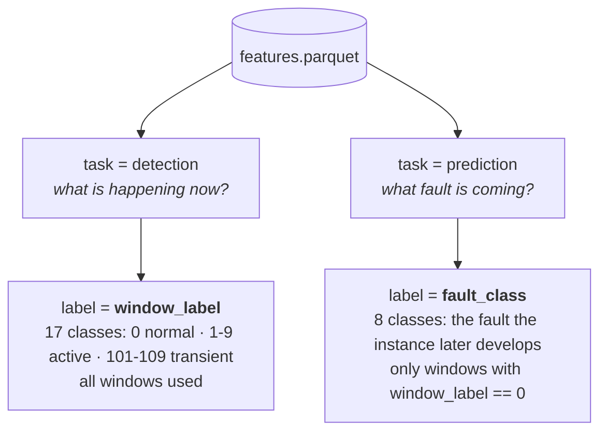
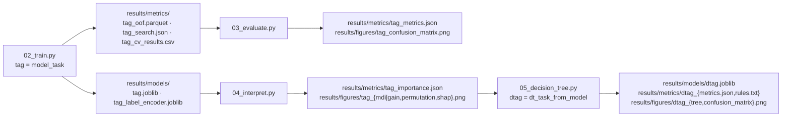

# flowml — streamlined 3W pipeline

Self-contained, script-based rewrite of the flow-assurance ML pipeline for the [Petrobras 3W dataset](https://github.com/petrobras/3W).

Two tasks, two tree models (Random Forest, XGBoost), four stages, one features parquet.

## Pipeline

```mermaid
flowchart LR

  subgraph S1["Dataset building (01_build_features.py)"]
    direction TB
    A[("3W raw parquets<br/>1 file = 1 well instance")] --> B["clean<br/>ffill ≤ 60 s · quality gate"]
    B --> C["z-score<br/>per instance"]
    C --> D["window 300 s / step 150 s<br/>11 stats × 8 sensors = 88 features"]
    D --> E[("data/features.parquet<br/>labels: window_label + fault_class")]
  end

  subgraph S2["Train/Test/Tree Pipeline"]
    direction TB
    F["02_train.py<br/>GroupKFold search for best F1 Macro <br>+ OOF"] --> G["03_evaluate.py<br/>metrics + confusion matrix"]
    G --> H["04_interpret.py<br/>MDI · gain · permutation · SHAP"]
    H --> I["05_decision_tree.py<br/>compact tree on top SHAP features"]
  end

  S1 --> S2

  style S1 fill:#000000
  style S2 fill:#000000
```



`main.py` orchestrates all five stages in order (stage 1 is skipped when its parquet already exists).

## The two tasks

Every window row carries **both** labels, so one parquet serves both tasks:



> [!NOTE]
> Prediction has 8 classes (not 10) because faults 3 (severe slugging) and 4 (flow instability) have no recorded normal-operation period in 3W.

## Quickstart

Requires [Python](https://www.python.org/) 3.13 or higher, [uv](https://docs.astral.sh/uv/) and a local copy of the [3W dataset](https://github.com/petrobras/3W).
First, create a virtual environment

```bash
uv sync
```

Point at the 3W dataset (or edit [`src/flowml/config.py`](src/flowml/config.py))

```bash
export FLOWML_RAW_DATA_DIR="/path/to/3w/dataset"      # PowerShell: $env:FLOWML_RAW_DATA_DIR = "..."
```

the everything at once (defaults: ``--model xgb --task prediction``)

```bash
uv run main.py                      # add --max-instances 3 for a quick smoke test
```

or run stage by stage

```bash
uv run scripts/01_build_features.py
uv run scripts/02_train.py
uv run scripts/03_evaluate.py
uv run scripts/04_interpret.py
uv run scripts/05_decision_tree.py  # compact tree on the top SHAP features
```

Every stage takes the same switches, and each combination writes its artifacts
under a unique tag:

| Switch         | Choices                       | Default        | Stages |
| -------------- | ----------------------------- | -------------- | ------ |
| `--model`    | `rf`, `xgb`               | `xgb`        | 2–5   |
| `--task`     | `prediction`, `detection` | `prediction` | 2–5   |
| `--grouping` | `none`, `hydrate`         | `none`       | 3, 5   |

## Class groupings

`--grouping hydrate` collapses the classes onto the operational triage
question: is the well heading for normal operation, a hydrate event, or some
other flow-assurance problem? Faults 8 and 9 become **Hydrate**, every other
fault becomes **Other Problem**, and transients follow their active
counterpart:

| Fault Number | Fault Name                 | New Number | New Name      |
| ------------ | -------------------------- | ---------- | ------------- |
| 0            | Normal                     | 0          | Normal        |
| 1            | Abrupt BSW Increase        | 1          | Other Problem |
| 2            | Spurious DHSV Closure      | 1          | Other Problem |
| 3            | Severe Slugging            | 1          | Other Problem |
| 4            | Flow Instability           | 1          | Other Problem |
| 5            | Rapid Productivity Loss    | 1          | Other Problem |
| 6            | Quick PCK Restriction      | 1          | Other Problem |
| 7            | PCK Scaling                | 1          | Other Problem |
| 8            | Hydrate in Production Line | 2          | Hydrate       |
| 9            | Hydrate in Service Line    | 2          | Hydrate       |

> [!WARNING]
> Grouping affects **scoring only**, features and the ensemble are always built on the full class set.

Stage 5 then compares two ways of reaching the grouped labels, both scored against the same truth:

| Strategy     | Trains on                                        | Answers                                                            |
| ------------ | ------------------------------------------------ | ------------------------------------------------------------------ |
| `collapse` | Full class set, predictions collapsed afterwards | How well does the existing tree already serve the triage question? |
| `native`   | The grouped labels directly                      | What does spending the whole depth budget on this distinction buy? |

> [!TIP]
> You can use a custom grouping of your own by editing the `CUSTOM_GROUPING` variable in [`src/flowml/config.py`](src/flowml/config.py). Then, to use it, set
>
> ```bash
> --grouping custom
> ```

## Artifacts



## Layout

```
.
├── pyproject.toml            uv project (flowml package, src layout)
├── src/flowml/
│   ├── config.py             paths · sensors · class maps · constants
│   ├── preprocessing.py      loading · cleaning · z-score
│   ├── features.py           windowing · 88 features · labeling
│   ├── training.py           task datasets · pipelines · CV search · OOF
│   ├── evaluation.py         metrics · confusion matrix
│   ├── interpretation.py     MDI · gain · permutation · SHAP
│   └── cli.py                shared argparse
├── main.py                   runs all stages in order
├── scripts/                  the 5 pipeline stages (thin CLIs)
├── data/                     generated features (git-ignored)
└── results/                  models · metrics · figures (mostly git-ignored)
```

## Methodology notes

- **GroupKFold by `instance_id`** everywhere so windows of one well never split
  across train/test.
- **Imputation inside the model pipeline** (`SimpleImputer(median)`), so it is
  refit per fold, avoiding leakage. This replaces the two divergent imputation
  strategies of the original repo.
- **Balanced classes**: RF via `class_weight="balanced"`; XGBoost via sample
  weights computed **per training fold** (the original computed them globally).
- **Outliers preserved**: pressure spikes are fault signatures; `max_zscore`
  captures them instead of removing them.
- Deep-learning branches (CNN-1D, CNN-LSTM) of the original repo were dropped
  deliberately: the end goal is interpretable tree models built on the top
  SHAP features. Since filtering was only effective with those methods, it was also dropped.
