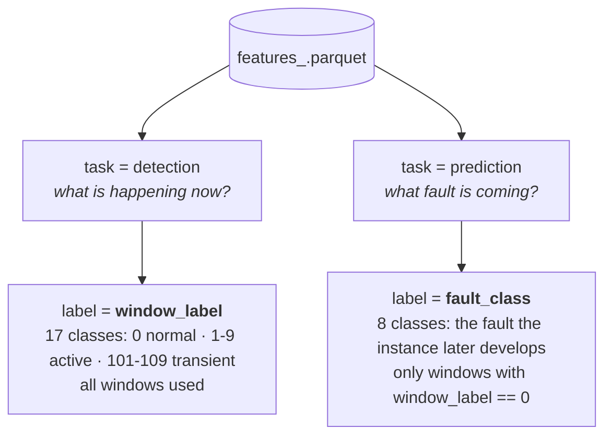
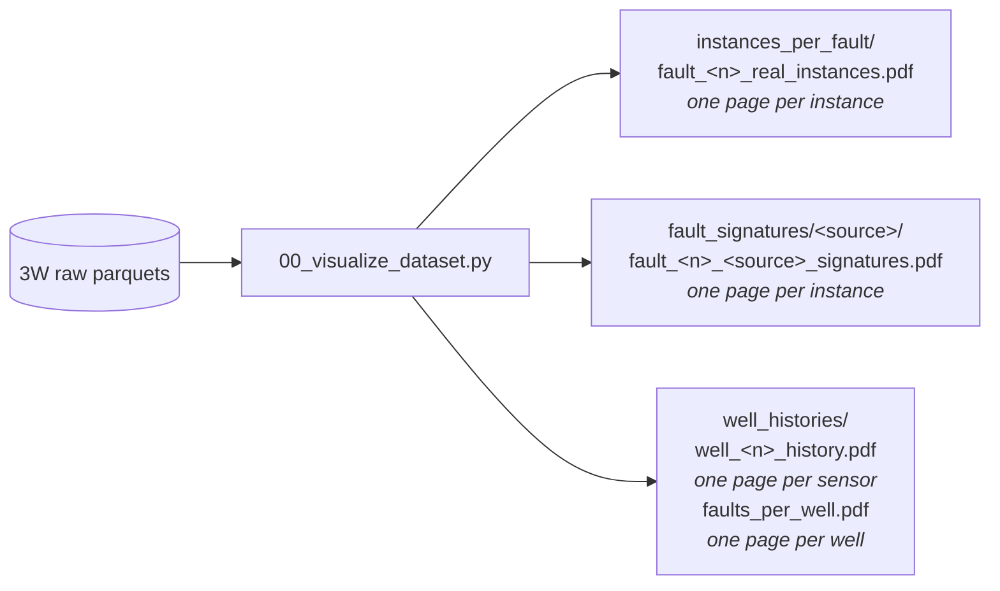
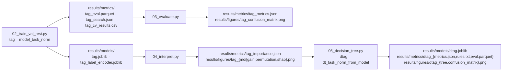

# flowml — streamlined 3W pipeline

Self-contained, script-based rewrite of the flow-assurance ML pipeline for the [Petrobras 3W dataset](https://github.com/petrobras/3W).

Two tasks, two tree models (Random Forest, XGBoost), four stages, one features parquet per normalization mode.

## Pipeline

```mermaid
flowchart LR

  subgraph S1["Dataset building (01_build_features.py)"]
    direction TB
    A[("3W raw parquets<br/>1 file = 1 well instance")] --> B["clean<br/>ffill ≤ 60 s · quality gate"]
    B --> C["z-score per instance<br/>(skipped with --no-normalization)"]
    C --> D["window 300 s / step 150 s<br/>11 stats × 8 sensors = 88 features"]
    D --> E[("data/features_<norm>.parquet<br/>norm: zscore | raw<br/>labels: window_label + fault_class")]
  end

  subgraph S2["Train/Test/Tree Pipeline"]
    direction TB
    F["02_train_val_test.py<br/>grouped search (val) + held-out test"] --> G["03_evaluate.py<br/>metrics + confusion matrix"]
    G --> H["04_interpret.py<br/>MDI · gain · permutation · SHAP"]
    H --> I["05_decision_tree.py<br/>compact tree on top SHAP features"]
  end

  S1 --> S2

  style S1 fill:#000000
  style S2 fill:#000000
```



`main.py` orchestrates all five stages in order (stage 1 is skipped when its parquet already exists).

## The two tasks

Every window row carries **both** labels, so one parquet serves both tasks:



> [!NOTE]
> Prediction has 8 classes (not 10) because faults 3 (severe slugging) and 4 (flow instability) have no recorded normal-operation period in 3W.

## Quickstart

Requires [Python](https://www.python.org/) 3.13 or higher, [uv](https://docs.astral.sh/uv/) and a local copy of the [3W dataset](https://github.com/petrobras/3W).
First, create a virtual environment

```bash
uv sync
```

Point at the 3W dataset (or edit [`src/flowml/config.py`](src/flowml/config.py))

```bash
export FLOWML_RAW_DATA_DIR="/path/to/3w/dataset"      # PowerShell: $env:FLOWML_RAW_DATA_DIR = "..."
```

the everything at once (defaults: ``--model xgb --task prediction``)

```bash
uv run main.py                      # add --max-instances 3 for a quick smoke test
```

or run stage by stage

```bash
uv run scripts/01_build_features.py
uv run scripts/02_train_val_test.py
uv run scripts/03_evaluate.py
uv run scripts/04_interpret.py
uv run scripts/05_decision_tree.py  # compact tree on the top SHAP features
```

Every stage takes the same switches, and each combination writes its artifacts
under a unique tag:

| Switch                 | Choices                               | Default               | Stages |
| ---------------------- | ------------------------------------- | --------------------- | ------ |
| `--model`            | `rf`, `xgb`                       | `xgb`               | 2-5    |
| `--task`             | `prediction`, `detection`         | `prediction`        | 2-5    |
| `--class-grouping`   | `standard`, `hydrate`, `custom` | `standard`          | 3, 5   |
| `--eval`             | `holdout`, `nested`               | `holdout`           | 2-5    |
| `--cv-group`         | `instance_id`, `well_id`          | `instance_id`       | 2-5    |
| `--no-normalization` | flag                                  | off                   | 1-5    |
| `--n-jobs`           | int (`-1` = all cores)              | `min(6, cores - 2)` | 2, 4   |
| `--verbose`          | flag                                  | off                   | 1-5    |

`--no-normalization` skips the per-instance z-score in stage 1 and makes every
stage read and write the `_raw` artifacts instead of `_zscore`, so both
feature sets and their runs coexist side by side.

`--eval` selects how the tuned model is evaluated. `holdout` (default) splits
a grouped test set (`TEST_SIZE` = 20 % of the groups, seeded) off **before**
the hyperparameter search, runs the GroupKFold search on the remainder, and
scores the refit winner once on the untouched test set — so the reported
metrics are never the scores the winner was selected on. `nested` runs a
grouped nested CV instead: every outer fold selects its own hyperparameters
with an inner search and predicts its held-out fold — unbiased and uses all
data for evaluation, at roughly `N_SPLITS_OUTER` (= 5) times the cost; the
saved model then comes from one final search on all data. Nested runs append
`_nested` to their artifact tags.

`--cv-group` selects what every grouped split keeps together: `instance_id`
(one recording never splits across train/test) or `well_id` (no recording of a
well in training when another recording of the same well is under test). Well
IDs are parsed from the instance filename (`WELL-00026_... -> 26`); simulated
and hand-drawn instances have no physical well, so they are **dropped** when
`well_id` grouping is chosen. Well-grouped runs append `_wellcv` to their
artifact tags.

## Dataset visualization

Independent of the modeling pipeline, stage 0 plots the raw dataset itself as available in the 3W repository:

```bash
uv run scripts/00_visualize_dataset.py          # add --verbose for per-instance progress
```

Each family of plots gets its own directory under `results/figures/`:



- **`instances_per_fault/fault_<n>_real_instances.pdf`** — one PDF per fault
  class, one page per instance: the well operational status (`state`) and
  label (`class`) as colored bands, then every sensor with data, shaded by
  label (green = normal, yellow = transient, red = active fault, grey =
  unlabeled) with units from the 3W `dataset.ini` and the total variation (Δ)
  per panel.
- **`fault_signatures/<source>/fault_<n>_<source>_signatures.pdf`** — one PDF
  per fault class and instance source (`real`, `simulated`, `drawn`), one page
  per instance: the *signature* of the fault, i.e. the handful of variables
  whose joint behavior identifies it, drawn on a single time axis with one
  colored y axis each, over the same bands and the same label shading as
  above. Where the plot above asks *what did this instance record?*, this one
  asks *does this instance look like its fault?* — the pressure upstream of
  the choke falling while the downhole pressure rises, say. The legend gives
  each variable its unit and Δ; a variable the instance does not carry keeps
  its axis, marked `not recorded`, and one that never moves is drawn flat
  instead of being autoscaled into noise.
- **`well_histories/well_<n>_history.pdf`** — one PDF per well, one page per
  sensor. All instances of the well are stitched together in time and the well
  operational status (`state`) and label (`class`) are color-banded; the
  sensor is drawn as a min/max envelope and the months of silence between
  recordings collapse to narrow marked blanks.
- **`well_histories/faults_per_well.pdf`** — one page per well: every instance
  recorded on it as a horizontal bar from its first to its last timestamp,
  labeled with the timestamp of its filename and stacked on top of the
  instances it overlaps in time, so the overlap that leaks between train and
  test is visible per well. Bar hue is the fault-class folder; its tint says
  how far the fault got inside that window (full once the steady state is
  reached, lighter when only the transient state is, lightest when no fault
  is reached at all), and the legend names hue and tint together, one entry
  per color the page draws. The months of silence between recordings collapse
  to narrow marked blanks, the time scale staying uniform everywhere else.

> [!NOTE]
> Everything keyed to a physical well — the instance histories, the well
> histories and the fault timeline — covers **real instances only**, since
> simulated and hand-drawn instances have no well to belong to. Signatures are
> about the shape of an event rather than about a well, so they are drawn for
> all three sources.

Only the faults the [3W Dataset 2.0.0 paper](https://doi.org/10.1038/s41597-026-07225-z)
illustrates (its figures 3 to 7) have a published signature, and not every one
of them exists in every source:

| Fault                          | Signature variables                          | real | simulated | drawn |
| ------------------------------ | -------------------------------------------- | ---- | --------- | ----- |
| 0 — Normal                     | ABER-CKP · ESTADO-SDV-P · ESTADO-W1 · T-TPT | 594  | —         | —     |
| 2 — Spurious DHSV Closure      | P-MON-CKP · P-PDG · P-TPT · T-TPT           | 22   | 16        | —     |
| 3 — Severe Slugging            | P-MON-CKP · P-PDG · P-TPT · T-JUS-CKP       | 32   | 74        | —     |
| 6 — Quick PCK Restriction      | ABER-CKP · P-MON-CKP · P-PDG · P-TPT        | 6    | 215       | —     |
| 8 — Hydrate in Production Line | P-MON-CKP · P-PDG · P-TPT · T-TPT           | 14   | 81        | —     |

The hand-drawn instances of 3W 2.0.0 cover only faults 1 and 7, so the `drawn`
directory stays empty until those two faults get a signature of their own in
`FAULT_SIGNATURES` ([`src/flowml/visualization.py`](src/flowml/visualization.py)) —
adding an entry there is all it takes for stage 0 to pick a fault up.

## Class groupings

`--class-grouping hydrate` collapses the classes onto the operational triage
question: is the well heading for normal operation, a hydrate event, or some
other flow-assurance problem? Faults 8 and 9 become **Hydrate**, every other
fault becomes **Other Problem**, and transients follow their active
counterpart. Group numbers are assigned by a `LabelEncoder` fit on the group
names, i.e. alphabetically:

| Fault Number | Fault Name                 | New Number | New Name      |
| ------------ | -------------------------- | ---------- | ------------- |
| 0            | Normal                     | 1          | Normal        |
| 1            | Abrupt BSW Increase        | 2          | Other Problem |
| 2            | Spurious DHSV Closure      | 2          | Other Problem |
| 3            | Severe Slugging            | 2          | Other Problem |
| 4            | Flow Instability           | 2          | Other Problem |
| 5            | Rapid Productivity Loss    | 2          | Other Problem |
| 6            | Quick PCK Restriction      | 2          | Other Problem |
| 7            | PCK Scaling                | 2          | Other Problem |
| 8            | Hydrate in Production Line | 0          | Hydrate       |
| 9            | Hydrate in Service Line    | 0          | Hydrate       |

> [!WARNING]
> Grouping affects **scoring only**, features and the ensemble are always built on the full class set.

Stage 5 then compares two ways of reaching the grouped labels, both scored against the same truth:

| Strategy     | Trains on                                        | Answers                                                            |
| ------------ | ------------------------------------------------ | ------------------------------------------------------------------ |
| `collapse` | Full class set, predictions collapsed afterwards | How well does the existing tree already serve the triage question? |
| `native`   | The grouped labels directly                      | What does spending the whole depth budget on this distinction buy? |

> [!TIP]
> You can use a custom grouping of your own by editing the `CUSTOM_CLASS_GROUPING` variable in [`src/flowml/config.py`](src/flowml/config.py) (every fault must get a non-empty group name). Then, to use it, set
>
> ```bash
> --class-grouping custom
> ```

## Artifacts



## Layout

```
.
├── pyproject.toml            uv project (flowml package, src layout)
├── src/flowml/
│   ├── config.py             paths · sensors · class maps · constants
│   ├── preprocessing.py      loading · cleaning · z-score
│   ├── features.py           windowing · 88 features · labeling
│   ├── train_val_test.py     task datasets · pipelines · CV search · held-out evaluation
│   ├── evaluation.py         metrics · confusion matrix
│   ├── interpretation.py     MDI · gain · permutation · SHAP
│   ├── visualization.py      raw-dataset plots (instances · signatures · well histories)
│   └── cli.py                shared argparse
├── main.py                   runs all stages in order
├── scripts/                  the pipeline stages + dataset visualization (thin CLIs)
├── data/                     generated features (git-ignored)
└── results/                  models · metrics · figures (mostly git-ignored)
    └── figures/
        ├── instances_per_fault/   one PDF per fault class
        ├── fault_signatures/      one subdirectory per instance source
        │   ├── real/
        │   ├── simulated/
        │   └── drawn/
        └── well_histories/        one PDF per well + the fault timeline
```

## Methodology notes

- **Grouped splits everywhere**, by `instance_id` (default) so windows of one
  recording never split across train/test, or by `well_id` (`--cv-group well_id`) so all recordings of one well stay on the same side.
- **Selection kept separate from evaluation**: hyperparameters are chosen on
  train+val only (GroupKFold search) and the winner is scored on data the
  search never saw — a grouped holdout test set by default, or nested CV with
  `--eval nested`. Validation scores are never reported as test scores. The
  stage-5 depth sweep follows the same protocol, on the same seeded holdout
  split, so the tree and the ensemble are judged on identical test data.
- **Imputation inside the model pipeline** (`SimpleImputer(median)`), so it is
  refit per fold, avoiding leakage. This replaces the two divergent imputation
  strategies of the original repo.
- **Balanced classes**: RF via `class_weight="balanced"`; XGBoost via sample
  weights computed **per training fold** (the original computed them globally).
- **Outliers preserved**: pressure spikes are fault signatures; `max_zscore`
  captures them instead of removing them. On z-scored features it is the
  largest absolute value of the window — a z-score relative to the instance
  baseline, never re-normalized within the window; only on raw features
  (`--no-normalization`) is it computed within the window itself.
- **Per-instance z-score is optional**: `--no-normalization` builds features
  on the raw sensor values, letting absolute operating levels reach the model.
- Deep-learning branches (CNN-1D, CNN-LSTM) of the original repo were dropped
  deliberately: the end goal is interpretable tree models built on the top
  SHAP features. Since filtering was only effective with those methods, it was also dropped.
