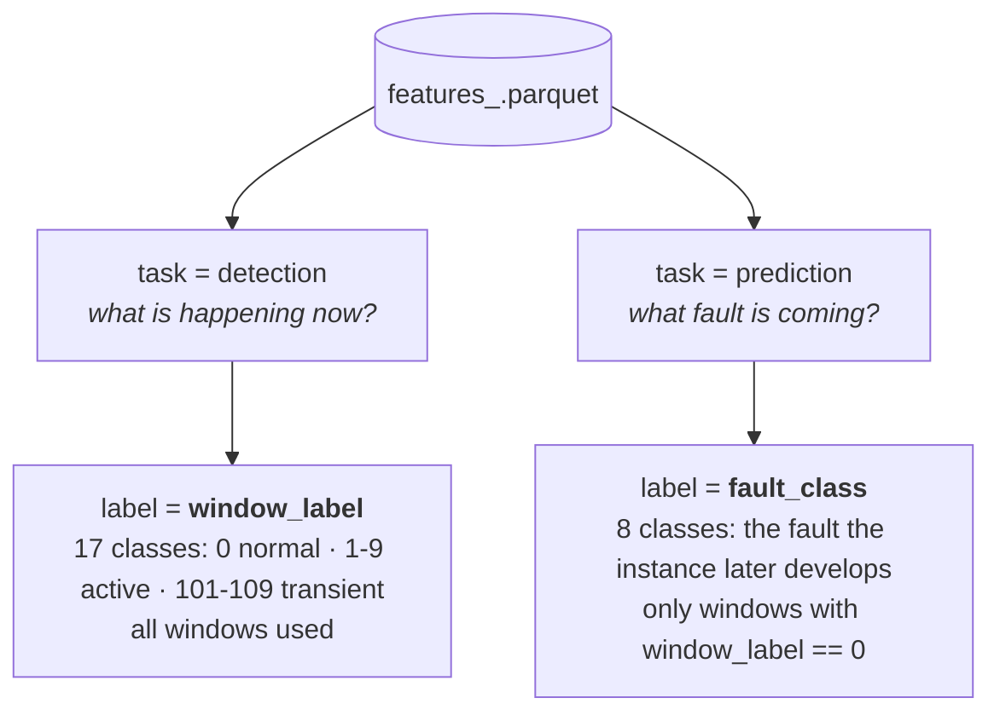
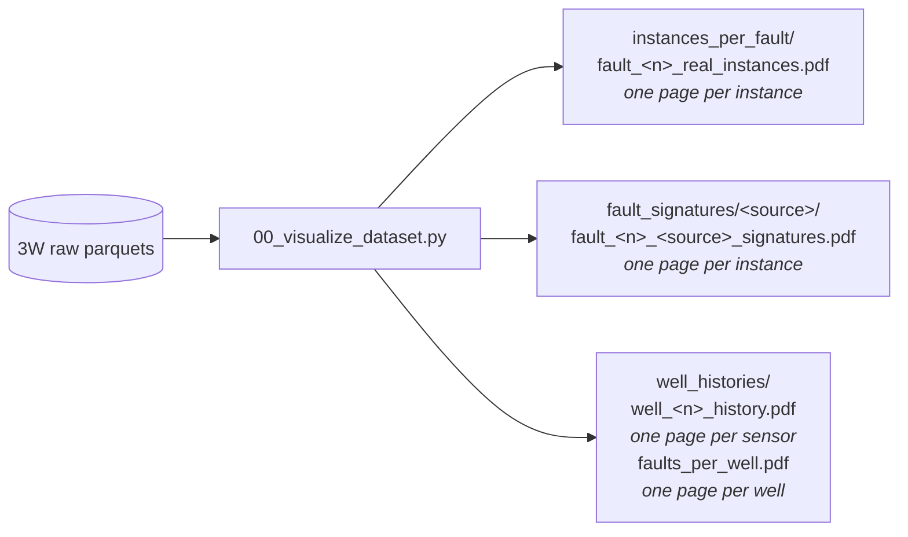
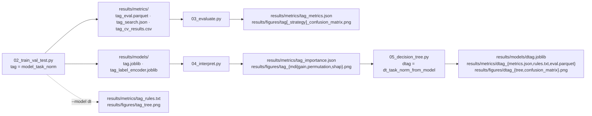

# flowml — streamlined 3W pipeline

Self-contained, script-based rewrite of the flow-assurance ML pipeline for the [Petrobras 3W dataset](https://github.com/petrobras/3W).

Two tasks, three tree models (Random Forest, XGBoost, a single decision tree), four stages, one features parquet per normalization mode.

## Pipeline

```mermaid
flowchart LR

  subgraph S1["Dataset building (01_build_features.py)"]
    direction TB
    A[("3W raw parquets<br/>1 file = 1 well instance")] --> A2["drop overlapping instances<br/>(kept with --allow-overlap)"]
    A2 --> A3["mask implausible readings → NaN<br/>magnitude · negative pressure · temperature<br/>(kept with --keep-extreme-values)"]
    A3 --> B["clean<br/>ffill ≤ 60 s · quality gate"]
    B --> C["z-score per instance<br/>(skipped with --no-normalization)"]
    C --> D["window 300 s / step 150 s<br/>11 stats × 8 sensors = 88 features"]
    D --> E[("data/features_<norm>.parquet<br/>norm: zscore | raw<br/>labels: window_label + fault_class")]
  end

  subgraph S2["Train/Test/Tree Pipeline"]
    direction TB
    F["02_train_val_test.py<br/>grouped search (val) + held-out test"] --> G["03_evaluate.py<br/>metrics + confusion matrix"]
    G --> H["04_interpret.py<br/>MDI · gain · permutation · SHAP"]
    H --> I["05_decision_tree.py<br/>compact tree on top SHAP features"]
    G -. "--model dt" .-> J["done: stage 2 already<br/>exported the tree itself"]
  end

  S1 --> S2

  style S1 fill:#000000
  style S2 fill:#000000
```



`main.py` orchestrates all five stages in order (stage 1 is skipped when its parquet already exists).

## The two tasks

Every window row carries **both** labels, so one parquet serves both tasks:



> [!NOTE]
> Prediction has 8 classes (not 10) because faults 3 (severe slugging) and 4 (flow instability) have no recorded normal-operation period in 3W.

## Quickstart

Requires [Python](https://www.python.org/) 3.13 or higher, [uv](https://docs.astral.sh/uv/) and a local copy of the [3W dataset](https://github.com/petrobras/3W).
First, create a virtual environment

```bash
uv sync
```

Point at the 3W dataset (or edit [`src/flowml/config.py`](src/flowml/config.py))

```bash
export FLOWML_RAW_DATA_DIR="/path/to/3w/dataset"      # PowerShell: $env:FLOWML_RAW_DATA_DIR = "..."
```

the everything at once (defaults: ``--model xgb --task prediction``)

```bash
uv run main.py                      # add --max-instances 3 for a quick smoke test
```

or run stage by stage

```bash
uv run scripts/01_build_features.py
uv run scripts/02_train_val_test.py
uv run scripts/03_evaluate.py
uv run scripts/04_interpret.py
uv run scripts/05_decision_tree.py  # compact tree on the top SHAP features
```

Every stage takes the same switches, and each combination writes its artifacts
under a unique tag:

| Switch                 | Choices                               | Default               | Stages |
| ---------------------- | ------------------------------------- | --------------------- | ------ |
| `--model`            | `rf`, `xgb`, `dt`               | `xgb`               | 2-5    |
| `--task`             | `prediction`, `detection`         | `prediction`        | 2-5    |
| `--class-grouping`   | `standard`, `hydrate`, `custom` | `standard`          | 2-5    |
| `--eval`             | `holdout`, `nested`, `leave-one-out` | `holdout` with `instance_id`, `leave-one-out` with `well_id` | 2-5 |
| `--cv-group`         | `instance_id`, `well_id`          | `instance_id`       | 2-5    |
| `--no-normalization` | flag                                  | off                   | 1-5    |
| `--allow-overlap`    | flag                                  | off                   | 1-5    |
| `--keep-extreme-values` | flag                               | off                   | 1-5    |
| `--n-jobs`           | int (`-1` = all cores)              | `min(6, cores - 2)` | 2, 4   |
| `--verbose`          | flag                                  | off                   | 1-5    |

`--model dt` fits a single decision tree where `rf` and `xgb` fit an ensemble
of them. It runs through the same grouped hyperparameter search
(`DT_PARAM_GRID`) and the same held-out evaluation as the other two, and stage
2 additionally exports it as if/else rules (`results/metrics/<tag>_rules.txt`)
and as a drawing (`results/figures/<tag>_tree.png`). Stages 4 and 5 are then
skipped: they exist to read a black box — rank what drives an ensemble, then
distil that ranking into a compact tree — and this model is that tree already.
`main.py` skips them on its own, and running either one directly with
`--model dt` prints why and exits.

> [!NOTE]
> The tree fit here is the *best* tree for the task, not a compact one: the
> search is free to pick `max_depth = None`, and on prediction it picks depth
> 12 with 171 leaves — a poster of a figure rather than something to read at
> a glance. It is still drawn in full and without overlaps: the tree is drawn
> once on a probe canvas, its widest and tallest node box are measured, and
> the figure is then made exactly as large as it takes for the closest pair
> of nodes on any level to sit `TREE_FIGURE_NODE_GAP` apart
> (`interpretation.tree_canvas_size`). A tree large enough to exceed what
> matplotlib can rasterize (`TREE_FIGURE_MAX_PIXELS`) loses PNG resolution
> rather than the figure, and gets a vector `<tag>_tree.pdf` beside the PNG.
> For a deliberately small tree, distil an ensemble with stage 5, which
> sweeps depths 2 to 12 over the top SHAP features only.

**Every exported tree is pruned first.** A tree fit for purity keeps
splitting as long as a split lowers impurity, even when both sides then
predict the same class — those splits read as decisions the model makes and
are not. `interpretation.prune_redundant_splits` collapses every split whose
whole subtree agrees on one class, bottom up, so the published depth and leaf
count describe what the model actually decides. Predictions are provably
unchanged (`tree_.value` at a node is the class distribution of the samples
reaching it, and summing distributions that share an argmax keeps it; the one
node where an exact tie could flip the answer is left alone), so no metric
moves and the saved `.joblib` is the pruned model itself.

`--no-normalization` skips the per-instance z-score in stage 1 and makes every
stage read and write the `_raw` artifacts instead of `_zscore`, so both
feature sets and their runs coexist side by side.

`--allow-overlap` keeps the real instances that overlap another recording of
the same well in time. Stage 1 drops them by default: 3W instances are
windows cut from one continuous recording, and where two of them overlap the
shared samples enter the dataset twice — under different labels, since the
end of one instance is the start of the next (a pressure labeled *active
fault* in the first is *normal operation* in the second). Which instances go
is decided exactly as `faults_per_well.pdf` stacks them (see *Dataset
visualization*): every instance on stack level 2 or higher is removed, so the
survivors of a well never overlap one another. Simulated and hand-drawn
instances have no well and are never touched. With the flag, every stage
reads and writes `_overlap` artifacts, so both datasets and their runs
coexist; `--verbose` prints how many instances overlap and how many were
removed, per well.

`--keep-extreme-values` keeps the readings that cannot be measurements. Stage
1 replaces them with NaN by default, so they are imputed like any other
missing value. Four rules, each set from a survey of all 2228 instances so
that no genuine signal is at risk — real pressure spikes are fault signatures:

| Rule | Masks | Because |
| ---- | ----- | ------- |
| magnitude  | any sensor beyond `EXTREME_VALUE_LIMIT` (1e8), infinities included | well 6 reports `P-PDG = -1.2e42 Pa` and `T-PDG = -1.7e38 °C` for three entire instances; well 26 reports `P-JUS-CKP` around 1.4e9 Pa (14,000 bar). The largest *varying* reading below the limit is 4.9e7 and the smallest above it is 1.3e8, with nothing in between |
| negative pressure | a sensor of `PRESSURE_SENSORS` below `PRESSURE_MIN` (0) | 3W pressures are absolute, so a negative one is a broken or mis-mapped tag — a defect the 3W paper warns about. Zero is left alone: that is the frozen-at-zero case |
| negative opening | a sensor of `OPENING_SENSORS` (the two chokes) below `OPENING_MIN` (0) | an opening is a percentage; the one negative value in the dataset is well 30's `ABER-CKP` at −99.99 % throughout, a sentinel |
| temperature range | a sensor of `TEMPERATURE_SENSORS` outside `TEMPERATURE_LIMITS` (−50 to 250 °C) | catches the `-999` and `-99.99` sentinels the source system leaks in, and `T-PDG` readings of 30,000 °C. The floor stays below the coldest genuine reading (`T-TPT` reaches −33.8 °C, real Joule-Thomson cooling during a blowdown — the very condition hydrates form in) |

On the full dataset the default masks 6,743,993 readings across 73 instances —
2.9M negative pressures, 2.2M by magnitude, 1.4M temperatures, 162k openings —
emptying 81 sensor series for their instance. `--verbose` reports the totals per rule and
per sensor, and one line per affected instance. With the flag, every stage
reads and writes `_extremes` artifacts.

> [!NOTE]
> Masking can cost an instance: when the emptied sensor is the critical one
> (`P-TPT`), the quality gate then discards the instance. On 3W 2.0.0 that
> happens to 10 of 1750 instances — one whose `P-TPT` is frozen at 2.9e9 Pa
> and nine whose `P-TPT` is negative throughout. Wells 31 and 34 lose every
> instance they had, but no fault class loses well coverage.

`--eval` selects how the tuned model is evaluated. `holdout` splits a grouped
test set (`TEST_SIZE` = 20 % of the groups, seeded) off **before** the
hyperparameter search, runs the GroupKFold search on the remainder, and
scores the refit winner once on the untouched test set — so the reported
metrics are never the scores the winner was selected on. `nested` runs a
grouped nested CV instead: every outer fold selects its own hyperparameters
with an inner search and predicts its held-out fold — unbiased and uses all
data for evaluation, at roughly `N_SPLITS_OUTER` (= 5) times the cost; the
saved model then comes from one final search on all data. `leave-one-out` is
the nested protocol with **one group per outer fold**: as many inner searches
as there are groups, and a score for every group — with wells as groups, a
score per well, which no single holdout of a handful of wells can give. Runs
append `_nested` or `_loo` to their artifact tags.

Left unset, `--eval` follows the grouping (`EVAL_MODE_DEFAULTS`): `holdout`
with `instance_id`, `leave-one-out` with `well_id`. With a thousand instances
a seeded 20 % holdout is a fair draw; with 33 wells it is one draw of a
lopsided lottery — the 8 wells held out for prediction carry 52 % of the
windows and 68 % of normal operation, so a training prior of 49 % Normal
meets a test prior of 95 % Normal (see
`results/reports/2026-09-17_dt_from_xgb_cv_and_class_grouping.md`). Leaving
one well out at a time never lets one draw decide. The cost is real —
33 searches for the well grouping, over a thousand with instances — and the
log states the fit count before starting.

Whatever the protocol, **every split prints its composition**: windows and
groups per side and, per class, how much of the class each side holds and
what share of the side it makes up (`train_val_test.split_composition`), and
the outer folds log what they hold out. When the evaluation table has few
groups — always with wells — stage 3 also scores every group on its own
(`per_group` in the metrics JSON), so a well predicted entirely wrong shows
even when the pooled number hides it.

Stage 5 follows the same protocol as the ensemble: under `holdout` its depth
sweep runs on train+val and the chosen tree is scored once on the same test
set; under `nested` and `leave-one-out` every outer fold runs its own depth
sweep on its training part and predicts its held-out part, the pooled
predictions are scored (per group as well), and the exported tree is the
winner of a final sweep on all data — the same way stage 2 saves the model of
its final search. Tree and ensemble are thus always judged on identical
held-out data.

`--cv-group` selects what every grouped split keeps together: `instance_id`
(one recording never splits across train/test) or `well_id` (no recording of a
well in training when another recording of the same well is under test). Well
IDs are parsed from the instance filename (`WELL-00026_... -> 26`); simulated
and hand-drawn instances have no physical well, so they are **dropped** when
`well_id` grouping is chosen. Well-grouped runs append `_wellcv` to their
artifact tags.

**Every class on both sides of every split.** Rare classes live in few
groups — Severe Slugging is 31 of its 32 real instances in well 14 — so a
random grouped split can leave a class entirely in train (never evaluated) or
entirely in test (never learned; XGBoost even refuses to fit a fold that lacks
a class). Stages 2 and 5 therefore repair the seeded holdout split: for each
class missing from a side, one of its carrier groups on the other side is
picked at random (seeded, so both stages get the same split) and moved over,
provided the move does not strip the donor side of another class. A class that
occurs in a single group cannot be on both sides at once, and the run stops
with a message naming it — under `--cv-group well_id` the detection task hits
this, Quick PCK Restriction being a single well. The hyperparameter-search
folds and the nested outer folds get the same treatment, with one addition: a
class carried by a single group is pinned to training in every fold and never
validated on, the only way XGBoost can run at all. `--verbose` prints every
move and every pinned group. Legal is not balanced, though: a class present
on both sides may still have 92 % of its windows on one of them, and holding
out 20 % of the *wells* can hold out half the *windows* (the 8 test wells of
prediction/well_id carry 52 % of them). That is what the composition table
every split prints is for, and why well grouping defaults to
`--eval leave-one-out`.

## Dataset visualization

Independent of the modeling pipeline, stage 0 plots the raw dataset itself as available in the 3W repository:

```bash
uv run scripts/00_visualize_dataset.py          # add --verbose for per-instance progress
```

Each family of plots gets its own directory under `plots/` (`VISUALIZATION_DIR`):



- **`instances_per_fault/fault_<n>_real_instances.pdf`** — one PDF per fault
  class, one page per instance: the well operational status (`state`) and
  label (`class`) as colored bands, then every sensor with data, shaded by
  label (green = normal, yellow = transient, red = active fault, grey =
  unlabeled) with units from the 3W `dataset.ini` and the total variation (Δ)
  per panel; a sensor that never moves is held flat and marked so, instead of
  being autoscaled into noise.
- **`fault_signatures/<source>/fault_<n>_<source>_signatures.pdf`** — one PDF
  per fault class and instance source (`real`, `simulated`, `drawn`), one page
  per instance: the *signature* of the fault, i.e. the handful of variables
  whose joint behavior identifies it, drawn on a single time axis with one
  colored y axis each, over the same bands and the same label shading as
  above. Where the plot above asks *what did this instance record?*, this one
  asks *does this instance look like its fault?* — the pressure upstream of
  the choke falling while the downhole pressure rises, say. The legend gives
  each variable its unit and Δ; a variable the instance does not carry keeps
  its axis, marked `not recorded`, and one that never moves is drawn flat
  instead of being autoscaled into noise.
- **`well_histories/well_<n>_history.pdf`** — one PDF per well, one page per
  sensor. All instances of the well are stitched together in time and the well
  operational status (`state`) and label (`class`) are color-banded; the
  sensor is drawn as a min/max envelope and the months of silence between
  recordings collapse to narrow marked blanks.
- **`well_histories/faults_per_well.pdf`** — one page per well: every instance
  recorded on it as a horizontal bar from its first to its last timestamp,
  labeled with the timestamp of its filename and stacked on top of the
  instances it overlaps in time, so the overlap that leaks between train and
  test is visible per well. Bar hue is the fault-class folder; its tint says
  how far the fault got inside that window (full once the steady state is
  reached, lighter when only the transient state is, lightest when no fault
  is reached at all), and the legend names hue and tint together, one entry
  per color the page draws. The months of silence between recordings collapse
  to narrow marked blanks, the time scale staying uniform everywhere else.

> [!NOTE]
> Everything keyed to a physical well — the instance histories, the well
> histories and the fault timeline — covers **real instances only**, since
> simulated and hand-drawn instances have no well to belong to. Signatures are
> about the shape of an event rather than about a well, so they are drawn for
> all three sources.

Only the faults the [3W Dataset 2.0.0 paper](https://doi.org/10.1038/s41597-026-07225-z)
illustrates (its figures 3 to 7) have a published signature, and not every one
of them exists in every source:

| Fault                          | Signature variables                          | real | simulated | drawn |
| ------------------------------ | -------------------------------------------- | ---- | --------- | ----- |
| 0 — Normal                     | ABER-CKP · ESTADO-SDV-P · ESTADO-W1 · T-TPT | 594  | —         | —     |
| 2 — Spurious DHSV Closure      | P-MON-CKP · P-PDG · P-TPT · T-TPT           | 22   | 16        | —     |
| 3 — Severe Slugging            | P-MON-CKP · P-PDG · P-TPT · T-JUS-CKP       | 32   | 74        | —     |
| 6 — Quick PCK Restriction      | ABER-CKP · P-MON-CKP · P-PDG · P-TPT        | 6    | 215       | —     |
| 8 — Hydrate in Production Line | P-MON-CKP · P-PDG · P-TPT · T-TPT           | 14   | 81        | —     |

The hand-drawn instances of 3W 2.0.0 cover only faults 1 and 7, so the `drawn`
directory stays empty until those two faults get a signature of their own in
`FAULT_SIGNATURES` ([`src/flowml/visualization/signatures.py`](src/flowml/visualization/signatures.py)) —
adding an entry there is all it takes for stage 0 to pick a fault up.

## Class groupings

`--class-grouping hydrate` reduces the classes to the operational triage
question: is the well heading for normal operation, a hydrate event, or some
other flow-assurance problem? Faults 8 and 9 become **Hydrate**, every other
fault becomes **Other Problem**, and transients follow their active
counterpart. Group numbers are assigned by a `LabelEncoder` fit on the group
names, i.e. alphabetically:

| Fault Number | Fault Name                 | New Number | New Name      |
| ------------ | -------------------------- | ---------- | ------------- |
| 0            | Normal                     | 1          | Normal        |
| 1            | Abrupt BSW Increase        | 2          | Other Problem |
| 2            | Spurious DHSV Closure      | 2          | Other Problem |
| 3            | Severe Slugging            | 2          | Other Problem |
| 4            | Flow Instability           | 2          | Other Problem |
| 5            | Rapid Productivity Loss    | 2          | Other Problem |
| 6            | Quick PCK Restriction      | 2          | Other Problem |
| 7            | PCK Scaling                | 2          | Other Problem |
| 8            | Hydrate in Production Line | 0          | Hydrate       |
| 9            | Hydrate in Service Line    | 0          | Hydrate       |

The grouping reaches every stage but feature building, which it cannot
change: **stage 2 fits the model on the grouped labels**, stage 4 ranks that
model's features, and stages 3 and 5 score in the grouped label space. A
grouped run carries its grouping in its artifact tag
(`xgb_prediction_raw_overlap_hydrate`), so it sits beside the standard run
instead of replacing it.

> [!IMPORTANT]
> Every split is built from the dataset's **own** classes whatever label set
> is modeled (`TaskData.fine_y`), for two reasons: covering every fine class
> covers every group of them, and a split that does not depend on the label
> set is what lets a grouped run and a standard one be compared window for
> window. So the two runs share their folds exactly, and the comparisons
> below are like-for-like.

Stages 3 and 5 therefore compare two ways of reaching the grouped labels, both
scored against the same truth on the same held-out windows:

| Strategy     | Trains on                                        | Answers                                                            |
| ------------ | ------------------------------------------------ | ------------------------------------------------------------------ |
| `collapse` | Full class set, predictions collapsed afterwards | How well does the existing model already serve the triage question? |
| `native`   | The grouped labels directly                      | What does spending the whole capacity on this distinction buy?     |

`collapse` reads the standard run's stored predictions, `native` the grouped
run's, so **both runs must exist** for the comparison; stage 3 reports
whichever it finds and names the command for the other. In stage 5 the
pairing goes one step further: each strategy distils the SHAP ranking of the
ensemble trained on *the same labels it is* — the standard run's for
`collapse`, the grouped run's for `native` — so a native tree is no longer
handed features chosen for a question it is not asked.

The exported rules and drawing of each tree name the classes *that tree*
predicts: the fine fault classes for `collapse` (its predictions are grouped
afterwards, the tree itself is not), the groups for `native`.

A full grouped exploration is therefore two chains — the standard one and the
grouped one — which is what `main.py --class-grouping hydrate` runs:

```bash
uv run main.py --class-grouping hydrate --no-normalization --allow-overlap
```

> [!TIP]
> You can use a custom grouping of your own by editing the `CUSTOM_CLASS_GROUPING` variable in [`src/flowml/config.py`](src/flowml/config.py) (every fault must get a non-empty group name). Then, to use it, set
>
> ```bash
> --class-grouping custom
> ```

## Artifacts



The tag carries every switch that changes what a run produces, so all
configurations coexist: `xgb_prediction_raw_overlap_wellcv_loo_hydrate` is
XGBoost predicting faults from raw features with overlapping instances kept,
grouped and evaluated by well, leave-one-well-out, and fit on the hydrate
label set. With a class grouping, stages 3 and 5 write one `_metrics.json`
holding both strategies and strategy-suffixed figures beside it.

## Audits

Alongside the numbered stages, `scripts/audits/` holds standalone scripts
that inspect the dataset or the pipeline's splits without training anything.
They take the pipeline's shared switches where those apply, print to the
terminal and save a copy under `results/audits/`; the write-ups under
`results/reports/` cite their numbers.

| Script | Question it answers | Writes |
| ------ | ------------------- | ------ |
| `well_instances_auditing.py` | Which instances of a well overlap in time, and do the overlaps carry conflicting labels? | `well_instances_audit_<timestamp>.txt` |
| `split_composition_auditing.py` | What does each split hold, class by class, under each CV grouping and protocol — and which wells carry normal operation at all? | `split_composition_<...>_<timestamp>.txt` |
| `well_leakage_auditing.py` | How much of the instance-grouped test set comes from wells seen in training, per class; how do the real instances of each class concentrate in wells; how much of each class is synthetic? | `well_leakage_<...>_<timestamp>.txt` |
| `sensor_distributions_auditing.py` | Where do each well's pressure and temperature readings sit, against the simulated and hand-drawn instances — and how much of each is frozen at zero, masked by default, or missing? | `sensor_distributions.pdf` (one page per sensor) + `sensor_distributions_<timestamp>.txt` |
| `normalization_leakage_auditing.py` | Does per-instance z-scoring leak the coming fault into the normal-operation windows the prediction task learns from? | `normalization_leakage_<timestamp>.txt` |

```bash
uv run scripts/audits/split_composition_auditing.py --no-normalization --allow-overlap
uv run scripts/audits/well_leakage_auditing.py --no-normalization --allow-overlap
uv run scripts/audits/sensor_distributions_auditing.py          # reads the whole raw dataset; --max-instances 3 for a look
uv run scripts/audits/normalization_leakage_auditing.py
```

## Layout

```
.
├── pyproject.toml            uv project (flowml package, src layout)
├── src/flowml/
│   ├── config.py             paths · sensors · class maps · constants
│   ├── preprocessing.py      loading · cleaning · z-score
│   ├── features.py           windowing · 88 features · labeling
│   ├── train_val_test.py     task datasets · pipelines · CV search · holdout / nested / leave-one-out evaluation · split composition
│   ├── evaluation.py         metrics · per-group sheet · confusion matrix
│   ├── interpretation.py     MDI · gain · permutation · SHAP · tree export
│   ├── visualization/        raw-dataset plots, one module per family
│   │   ├── common.py         palettes · dataset.ini · label bands · envelope · PDF writing
│   │   ├── instances.py      plot_fault
│   │   ├── signatures.py     plot_fault_signatures
│   │   ├── wells.py          plot_well_history
│   │   └── timeline.py       plot_faults_per_well
│   └── cli.py                shared argparse (--eval defaults per --cv-group)
├── main.py                   runs all stages in order
├── scripts/                  the pipeline stages + dataset visualization (thin CLIs)
│   └── audits/               standalone dataset and split audits (see *Audits*)
├── tests/                    pytest suite
├── data/                     generated features (git-ignored)
├── plots/                    stage-0 dataset plots (git-ignored)
│   ├── instances_per_fault/   one PDF per fault class
│   ├── fault_signatures/      one subdirectory per instance source
│   │   ├── real/
│   │   ├── simulated/
│   │   └── drawn/
│   └── well_histories/        one PDF per well + the fault timeline
└── results/                  git-ignored
    ├── models/ metrics/ figures/   artifacts of stages 2-5, one tag per run
    ├── audits/                     what the audit scripts print
    └── reports/                    markdown write-ups of explorations, citing the above
```

## Methodology notes

- **Overlapping instances dropped** before anything else (`--allow-overlap`
  keeps them): two instances of one well that overlap in time carry the same
  samples under different labels, so of every overlapping stack only the
  bottom instance survives — the rule `faults_per_well.pdf` draws.
- **Grouped splits everywhere**, by `instance_id` (default) so windows of one
  recording never split across train/test, or by `well_id` (`--cv-group well_id`) so all recordings of one well stay on the same side — and every
  class on both sides of every split, repaired by moving carrier groups (see
  the class-coverage note above).
- **Selection kept separate from evaluation**: hyperparameters are chosen on
  train+val only (GroupKFold search) and the winner is scored on data the
  search never saw — a grouped holdout test set, nested CV, or leave-one-group-out
  (`--eval`; the default follows the grouping). Validation scores are never
  reported as test scores. The stage-5 depth sweep follows the same protocol
  on the same seeded splits, so the tree and the ensemble are judged on
  identical held-out data.
- **Splits are shown, not assumed**: every split prints windows, groups and
  the per-class share and prior of each side, because a grouped split can be
  legal and still put 92 % of a class on one side; with wells as groups every
  well is also scored on its own.
- **Imputation inside the model pipeline** (`SimpleImputer(median)`), so it is
  refit per fold, avoiding leakage. This replaces the two divergent imputation
  strategies of the original repo.
- **Balanced classes**: RF and the single decision tree via
  `class_weight="balanced"`; XGBoost via sample weights computed **per training
  fold** (the original computed them globally).
- **Outliers preserved, impossible values removed**: pressure spikes are fault
  signatures; `max_zscore` captures them instead of removing them. On z-scored
  features it is the largest absolute value of the window — a z-score relative
  to the instance baseline, never re-normalized within the window; only on raw
  features (`--no-normalization`) is it computed within the window itself.
  What stage 1 does remove (`--keep-extreme-values` keeps it) is readings that
  cannot be measurements at all: beyond 1e8 in magnitude, negative absolute
  pressures or choke openings, or temperatures outside −50…250 °C. Every bound sits beyond the
  most extreme genuine reading in the dataset, so no spike is at risk. Left
  in, they break the pipeline in both modes: raw, a `P-PDG` of -1.2e42 exceeds
  the float32 range XGBoost casts to and becomes infinite; z-scored, its
  standard deviation cannot be computed at that magnitude (57,424 identical
  values yield a spurious σ of 1.5e26 instead of 0), so the constant-sensor
  guard misses it and the instance gets a fake, perfectly flat feature of -1.0.
- **Per-instance z-score is optional**: `--no-normalization` builds features
  on the raw sensor values, letting absolute operating levels reach the model.
- Deep-learning branches (CNN-1D, CNN-LSTM) of the original repo were dropped
  deliberately: the end goal is interpretable tree models built on the top
  SHAP features. Since filtering was only effective with those methods, it was also dropped.
