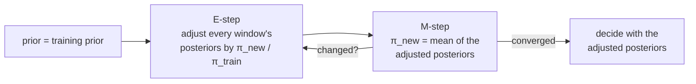
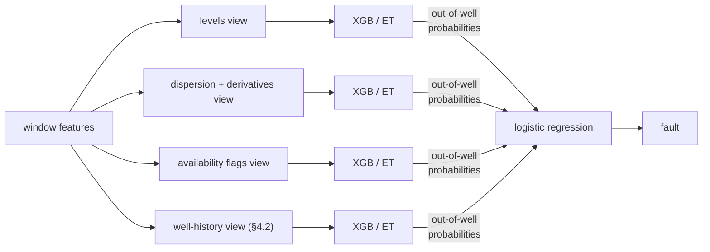
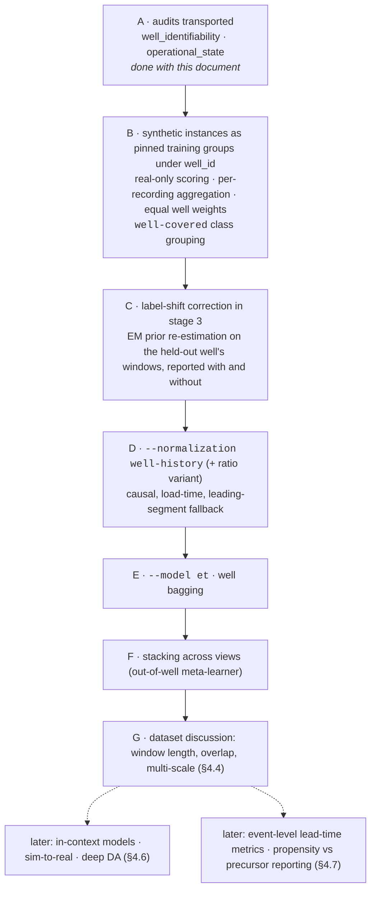

# Making the fault predictor work on wells it has never seen

**Date (created):** 2026-09-27. **Status:** planning document, not a report of finished work. The question,
the diagnostics and the literature are in §1–§3; §4 walks through the fronts of attack with Thiago's
review comments answered where they were raised; §5 is the implementation order those answers lead
to. The numbers in §2 come from `scripts/audits/well_identifiability_auditing.py` and
`scripts/audits/operational_state_auditing.py`, both added with this document; the artifacts they
wrote are named in the appendix.

---

## 1. The question

The instance-grouped protocol (`--cv-group instance_id`) is *solved* in the narrow sense that no
framework or model problem limits it given its goal — and its goal is faulty, because, as §2 shows,
its score is mostly a well look-up. It will not be used going forward. The well-grouped protocol
(`--cv-group well_id`) asks the question that matters — **which fault is coming, on a well that
contributed nothing to training?** — and every configuration tried so far scores around F1-macro
0.2–0.4 there against 0.8–0.95 with instances grouped
([report 3](../results/reports/2026-09-21_cv_grouping_and_well_generalization.md)). Normalization,
frozen-sensor handling and the model family have all been varied without changing that.

**Short answer.** The limitation sits at the root of the pipeline, in the data and its
representation, and models come second:

1. the current features identify the *well* far more reliably than the coming *fault*, and no
   normalization mode removes that fingerprint — half of it is instrumentation, which sensors a
   well has and which are dead;
2. the instance-grouped score is reproducible without any feature at all, by looking up which
   well a recording comes from;
3. whatever precursor a 5-minute normal window carries sits in the well's *operating point
   relative to its own history*, which a new well with no history cannot offer;
4. three of the eight classes live in two or three real wells, which no protocol can fix.

So the fronts worth attacking, in order, are the data that enters the well-grouped protocol,
representations relative to a well's own history, an explicit well-invariance objective for the
features, and only then learner families. The 3W literature agrees by omission: of the 24 works in
`../3W/docs/`, two evaluated unseen wells, and both saw the same collapse.

---

## 2. What the diagnostics say

Four probes on the real normal-operation windows of the prediction task, using the features parquet
as it is (`data/features_overlap.parquet`, 82,115 windows, 658 recordings, 33 wells). Nothing is
trained through the pipeline and nothing is tuned: an untuned random forest of 300 trees, median
imputation, balanced class weights. Each probe holds out a different thing, and that is what makes
them answer different questions:

```mermaid
flowchart LR
  subgraph Q1["1 · Is the window the well?"]
    direction TB
    A1["one normal window"] -->|"its recording held out<br/>(GroupKFold by instance)"| B1["which of the 33 wells?"]
  end
  subgraph Q2["2 · Is the instance-grouped score a look-up?"]
    direction TB
    A2["one recording"] -->|"no features:<br/>majority fault of the well's<br/>other recordings"| B2["which fault?"]
  end
  subgraph Q3["3 · Is there a precursor at all?"]
    direction TB
    A3["one recording of a well that has<br/>Normal AND fault recordings"] -->|"the well's other recordings<br/>train the forest"| B3["pre-fault normal<br/>or ordinary normal?"]
  end
  subgraph Q4["4 · What transfers across wells?"]
    direction TB
    A4["one window"] -->|"its whole well held out<br/>(GroupKFold by well)"| B4["which fault?"]
  end
  style Q1 fill:#000000
  style Q2 fill:#000000
  style Q3 fill:#000000
  style Q4 fill:#000000
```



### 2.1 Well-identifiability probe

Accuracy of naming the well from a single window whose recording was held out, at most 800 windows
per well. Uniform chance is 0.03; 10 wells have one recording and cannot be identified by
construction, so the ceiling is below 1.

| feature set                                              | features | accuracy | F1-macro |
| -------------------------------------------------------- | -------: | -------: | -------: |
| pipeline features,`none` (raw levels, `flag` policy) |       96 |     0.81 |     0.62 |
| pipeline features,`normal-operation-values`            |       96 |     0.71 |     0.48 |
| pipeline features,`instance` (the leaky reference)     |       96 |     0.71 |     0.54 |
| dispersion and derivative statistics only, raw           |       56 |     0.75 |     0.58 |
| sensor-to-sensor level differences along the flow path   |       12 |     0.78 |     0.59 |
| frozen flags only                                        |        8 |     0.24 |     0.17 |
| frozen + missing flags only                              |       16 |     0.56 |     0.42 |

Three readings:

- **No normalization removes the fingerprint.** The leak-free reference lowers it from 0.81 to
  0.71, and the shape-only statistics (no mean, min, max, median) still identify the well three
  times out of four.
- **Half of the fingerprint is instrumentation.** Sixteen bits saying which sensors are frozen or
  absent name the well better than even odds. `T-JUS-CKP` is entirely missing in 21 of the 42 real
  wells, `P-PDG` in 9, `P-TPT` in 5 (sensor distributions audit). This is what
  [report 2](../results/reports/2026-09-21_frozen_sensors_and_instrument_status.md) measured as the
  frozen indicators "transferring across wells": they transfer as a *well-type* prior — a dead
  downhole gauge co-occurs with a completion vintage and a fault profile — not as flow physics.
- **Differences between adjacent sensors are not well-invariant either.** The downhole-to-tree
  pressure drop is the well's hydrostatic head, i.e. a fingerprint. This matters because
  differential pressures are the one representation the 3W doctoral literature found to transfer
  (Aranha, §3) — for per-well anomaly *detection* over time, not for cross-well classification.

### 2.2 Well-lookup baseline

Predict each recording's fault as the majority fault of the *other* recordings of its well: no
features, no model.

|                                                                                       |   accuracy |   F1-macro |
| ------------------------------------------------------------------------------------- | ---------: | ---------: |
| well lookup                                                                           |       0.94 |       0.60 |
| instance-grouped XGBoost, all configurations of report 3 (real + synthetic test rows) | 0.93–0.96 | 0.82–0.95 |
| prior-sampled guessing                                                                |         — |      0.125 |

Per class the lookup recalls Normal 0.98, Rapid Productivity Loss 1.00, Hydrate in Service Line
0.95, PCK Scaling 0.94: those classes are "which well is it". It recalls Abrupt BSW Increase and
Quick PCK Restriction 0.00, which is where the ensembles do add something under instance grouping.
Two thirds of the instance-grouped result is a look-up, which is exactly why it does not survive
well grouping — and the reason the instance-grouped protocol will not be used.

### 2.3 Within-well control

Six real wells carry Normal recordings and fault recordings. Where a fault class has at least two
recordings in the well, a forest trained on the well's other recordings predicts the held-out
recording (leave-one-recording-out over the fault recordings), and its windows are aggregated by
majority vote:

| well | classes                                  | fault recordings recognized,`none` | fault recordings recognized,`normal-operation-values` |
| ---- | ---------------------------------------- | -----------------------------------: | ------------------------------------------------------: |
| 2    | Normal, Quick PCK Restriction            |                               3 of 3 |                                                  0 of 3 |
| 3    | Normal, Spurious DHSV Closure            |                               2 of 3 |                                                  1 of 3 |
| 4    | Normal, Quick PCK Restriction            |                               3 of 3 |                                                  2 of 3 |
| 6    | Normal, Abrupt BSW Increase, PCK Scaling |                               0 of 4 |                                                  0 of 4 |

With raw levels, 8 of 9 pre-fault recordings of wells 2–4 are told from the well's ordinary normal
operation; normalize the levels away and it drops to 3 of 9; in well 6 nothing works either way.
So the precursor that exists is a **shift of the operating point relative to the well's own
history**, not a change in the shape of the 5-minute window. The numbers are tiny (three
recordings per class) and a time confound is possible — the fault recordings and the Normal
recordings of a well were taken months apart — but both readings lead to the same design: a
window must be described relative to *that well's* earlier data (§4.2).

### 2.4 Well-grouped fault probe

Same forest, 5-fold `GroupKFold` by well, all windows, pooled out-of-fold predictions. Chance
F1-macro: 0.125 when sampling from the prior, 0.07 uniform.

| feature set                               | features | F1-macro | never recalled |
| ----------------------------------------- | -------: | -------: | -------------- |
| pipeline features,`none`                |       96 |     0.24 | 1, 5, 6        |
| dispersion and derivative statistics only |       56 |     0.28 | 5, 6           |
| flow-path level differences               |       12 |     0.22 | 1, 5, 6        |
| pipeline features + differences           |      108 |     0.20 | 1, 5, 6        |

No feature view beats the 0.19–0.41 of the tuned XGBoost runs of report 3 by more than noise;
classes 5 and 6 (two wells each) are never recalled by anything. **Feature engineering within the
current representation does not move this**; the data entering the protocol and the reference the
features are expressed against do.

### 2.5 Two things ruled out

- **Well state is not a confounder.** Every normal-operation sample of every real fault recording
  is in state Open; of the Normal recordings' samples 99.1 % are Open, and only well 19 has any
  shut-in, flushing or restart samples inside the Normal label
  (`scripts/audits/operational_state_auditing.py`).
- **Straight-ramp windows are rare.** Afrânio's thesis warns that 3W's 1 Hz series are
  interpolations of sparser PI measurements. Windows in which a sensor moves but its second
  difference does not (a straight ramp) are 0.0–0.1 % per sensor at 300 s, so the derivative
  statistics are not measuring interpolation outright — though per-well compression settings are a
  plausible part of the fingerprint the shape statistics carry.

---

## 3. What the 3W literature has tried

The 24 theses, dissertations and graduation projects in `../3W/docs/` were surveyed for one thing:
whether the work evaluated wells absent from training. Two did.

| work                                                                                                                                                                                   | task on 3W                                      | split unit                                                                      | unseen wells?                  | what it found                                                                                                                                                                                                                                                                                                     |
| -------------------------------------------------------------------------------------------------------------------------------------------------------------------------------------- | ----------------------------------------------- | ------------------------------------------------------------------------------- | ------------------------------ | ----------------------------------------------------------------------------------------------------------------------------------------------------------------------------------------------------------------------------------------------------------------------------------------------------------------- |
| [Carvalho 2021](../../3W/docs/master_degree_dissertation_bruno_carvalho.pdf) (UFES, MSc)                                                                                                   | flow instability, binary                        | **one well per fold**, nested for tuning and feature selection            | **yes**                  | RF F1 0.99 under a random split → 0.52–0.67 under the well split; one held-out well unlearnable (0.46), another easy (> 0.97). Genetic feature selection*inside* the well-split nested CV recovered 0.74–0.79. Dispersion statistics of `P-MON-CKP` transferred; the mean was the least-selected feature.  |
| [Santos 2020](../../3W/docs/master_degree_dissertation_mayara_santos.pdf) (UFF, MSc)                                                                                                       | hydrate, scaling, slugging vs instability       | train on well A, test on well B, each well divided by its own normal-state mean | **yes**                  | hydrate transferred (F1 ≥ 0.98, wells 20 → 21); scaling did not (only naive Bayes 0.87, others < 0.50); slugging vs instability did not (best 0.42). "Models must be trained and tested on the same well, and adapted over time."                                                                               |
| [Vargas 2019](../../3W/docs/doctoral_thesis_ricardo_vargas.pdf) (UFES, PhD, 3W's creator)                                                                                                  | the two original benchmarks                     | leave-one-real-*instance*-out; within-instance                                | no                             | training a rare class on real instances only scored F1 0.50; adding simulated or hand-drawn instances raised it to 0.88–0.90 on held-out real instances. Expert horizons per event (Table 1): DHSV closure 5–20 min, PCK restriction 15 min, hydrate 30 min–5 h, BSW and productivity loss 12 h, scaling 72 h. |
| [Azevedo 2024](../../3W/docs/master_degree_dissertation_antonio_azevedo.pdf) (COPPE, MSc)                                                                                                  | 17-state classification, LightGBM               | instance (50/20/30)                                                             | no                             | a real-instances-only test drops BalAcc 0.976 → 0.770; simulated classes 1, 6 and 8 are unrepresentative; class-1 instances form two`T-TPT` clusters the author attributes to well type.                                                                                                                       |
| [Brønstad 2020](../../3W/docs/master_degree_dissertation_chrisander_bronstad.pdf) (USN, MSc)                                                                                              | per-fault binary RF                             | instance                                                                        | no                             | the forest recognized "normal" from`QGL` being inactive — an instrumentation shortcut; proposes per-fault window lengths and output smoothing.                                                                                                                                                                 |
| [Machado](../../3W/docs/doctoral_thesis_andre_machado.pdf) (UFES, PhD)                                                                                                                     | one-class per fault, LSTM-AE                    | instance                                                                        | no                             | attributes intra-class heterogeneity to different wells and depletion; clustering training instances by DTW similarity and training a detector per cluster gains 10–21 %.                                                                                                                                        |
| [Aranha 2025](../../3W/docs/doctoral_thesis_pedro_aranha.pdf) (USP, PhD)                                                                                                                   | DHSV and ICV closures, per-well residual models | within instance / per well                                                      | no (per-well models by design) | states that "a general and generic model" across wells does not yet exist; on intelligent completions,**differential pressures between sensors** beat the raw sensors in every well (0.98 vs 0.47 on one), with per-well normalization and rolling retraining.                                              |
| [Lopes 2025](../../3W/docs/doctoral_thesis_lucas_lopes.pdf) (UFAL, PhD)                                                                                                                    | open-world learning, 3W 2.0                     | sample level                                                                    | no                             | one autoencoder trained on all wells found a new fault type on nine other wells (95 %) but false-alarmed on valve operations; one-vs-all classifiers with rejection.                                                                                                                                              |
| [Afrânio 2023](../../3W/docs/doctoral_thesis_afranio_junior.pdf) (COPPE, PhD)                                                                                                             | exploratory analysis                            | —                                                                              | —                             | documents per-well level offsets and variances; the 1 Hz series are interpolations of sparser measurements.                                                                                                                                                                                                       |
| [Rabelo 2026](../../3W/docs/final_graduation_project_gabriel_rabelo.pdf) (UnB, origin of this codebase)                                                                                    | 17-state classification                         | `GroupKFold` by instance                                                      | no                             | warns (p. 34) that a model "may learn well-specific patterns instead of genuine fault patterns" but never tests it; the text's "separation by well" (p. 86) describes a split the implementation makes by instance. Rate-of-change features are the main transient/active differentiator.                         |
| Rosa 2020, Alves 2023, Benedito 2025, Proença 2022, Albino & Fernandes 2023, Figueirêdo 2023, Nascimento 2021, Fernandes Júnior 2022, Vignoli 2021, Oliveira 2020, Turan, Momm 2022 | various                                         | window, instance or within-instance                                             | no                             | Rosa and Santos divide by the well's normal-state mean; Alves finds a supervised RF at F1 0.99 on a random split falling to 0.67 on hand-drawn instances; Benedito differences and log-transforms the sensors; Proença and the one-class benchmark train on the target's own normal period only (F1 ≈ 0.88).    |

Outside 3W the same problem has names: *blind-well testing* in petrophysics, *leave-one-subject-out*
in activity recognition. The method literature for it is domain generalization for time series
([DIVERSIFY](https://arxiv.org/abs/2308.02282), [RAINCOAT](https://arxiv.org/abs/2302.03133), the
[2025 survey](https://arxiv.org/abs/2503.13868), the [HAROOD benchmark](https://arxiv.org/abs/2512.10807)),
in-context tabular models under shift ([TabPFN v2](https://arxiv.org/abs/2502.17361),
[Drift-Resilient TabPFN](https://arxiv.org/abs/2411.10634), [MASHT](https://arxiv.org/abs/2607.19234),
which feeds MultiRocket and Hydra features to a tabular foundation model), and, from Petrobras
itself, synthetic hydrate data generated with a multiphase-flow simulator
([Carneiro et al., OTC Brasil 2025](https://onepetro.org/OTCBRASIL/proceedings-abstract/25OTCB/25OTCB/792299)).

---

## 4. Fronts of attack, with the review comments answered

### 4.1 Fix what enters the well-grouped protocol before touching models

**The front.** Today `--cv-group well_id` drops every simulated and hand-drawn instance (41 % of
the recordings), because they have no well to group by, and then asks classes 1, 5 and 6 to be
learned from three, two and two wells. 3W's own convention is the opposite: in `dataset.ini`,
`EXTRA_INSTANCES_TRAINING = -1` marks the synthetic instances as *training-only* — always on the
training side, never scored. Vargas's benchmark (§3) is the evidence: real-only training of a
rare class scored 0.50, real plus synthetic 0.88–0.90, on held-out real instances.

> **Comment 1.** *Bringing in simulated and drawn data has been on my mind. Would it still be fair
> to call it "well grouped"? Would these instances get a well ID each? How big a fold would they
> be? I believe my answers are the details behind "restrict the cross-well benchmark and fold the
> rest".*

**Answer.** Yes, it stays well-grouped, on one condition: **the scored side only ever contains real
wells.** The synthetic instances are not folds and are never held out; they sit on the training
side of *every* split — outer folds, the holdout, and the inner search folds alike. The mechanism
already exists: `train_val_test.coverage_folds` pins a class carried by a single group to the
training side of every fold; the synthetic instances get the same pinning, unconditionally. For the
grouping key they need a group each, and one per *source* is enough (`SIMULATED`, `DRAWN`), since
the only thing the key must guarantee is that they never land on a scored side. The fold count and
sizes are decided by the real wells alone: 33 outer folds under leave-one-out, exactly as now.

```mermaid
flowchart LR
  subgraph TRAIN["training side of every fold"]
    direction TB
    R1["real wells<br/>not held out"]
    S["SIMULATED instances<br/>(pinned)"]
    D["DRAWN instances<br/>(pinned)"]
  end
  subgraph TEST["scored side"]
    H["one real well<br/>(leave-one-out)"]
  end
  TRAIN -->|"fit + inner search"| M["model"]
  M -->|"predict"| H
  H -->|"per-well score,<br/>real windows only"| SC["F1-macro against<br/>the matched chance baseline"]
  style TRAIN fill:#000000
  style TEST fill:#000000
```



"Restrict and fold the rest" is the *label* side of the same decision and independent of it. With
synthetic support, classes 1, 5 and 6 can be trained, but their per-class scores still rest on the
two or three real wells that carry them, so any F1-macro over eight classes is decided by a handful
of wells. The proposal is a third class grouping, `well-covered`, that merges the classes with
fewer than five real wells (1, 5, 6) into *Other* and is the headline number, with the eight-class
figure reported beside it. `CLASS_GROUPINGS` and `--class-grouping` already support this with no
change to the split logic, because splits are built from the fine labels.

Two smaller parts of the same front, both about how the pooled score is read:

- **Score per recording, and weight wells equally.** Three wells hold 61 % of the windows, so the
  pooled window score is a three-well score. Stage 3 should also aggregate the window
  probabilities of each recording (mean probability, or majority vote) and score recordings; and
  training should give each well the same total weight (sample weight 1 / windows of the well) so
  that well 2's 24,000 windows do not decide what the model fits.
- **Correct the label shift** (Comment 2 below).

> **Comment 2.** *I don't understand the term EM (Expectation Maximization?) nor "a threshold
> calibrated on the target well's unlabeled windows". My intuition tells me both come down to
> over/downsampling instances smartly.*

**Answer.** EM is Expectation-Maximization, and neither is resampling. Resampling (or the
`balanced` class weights the pipeline already uses) changes **what the model learns**; prior
correction changes **how its probabilities are read** on a new well, using that well's unlabeled
windows and no labels. The mismatch it addresses is concrete: the training folds are about 49 %
Normal, a held-out well is 95 % Normal or 100 % one fault, and a model that was made to treat all
classes as equally likely over-predicts the minorities there — the failure mode report 1 described
as "over-predicting minorities on a 94.9 %-Normal test set".

The classifier outputs $p(c \mid x)$ under its training prior $\pi_{\text{train}}(c)$. If the new
well's class mix is $\pi_{\text{new}}(c)$, the calibrated posterior is

$$
p_{\text{new}}(c \mid x) \;\propto\; p(c \mid x)\,\frac{\pi_{\text{new}}(c)}{\pi_{\text{train}}(c)} .
$$

$\pi_{\text{new}}$ is unknown, so EM estimates it from the well's own windows
([Saerens, Latinne &amp; Decaestecker, 2002](https://doi.org/10.1162/089976602753284446)): start from
the training prior, compute the adjusted posteriors of all the well's windows (E-step), set the
new prior to their average (M-step), repeat until it stops moving.



"A threshold calibrated on the target well's unlabeled windows" is the two-class version of the
same idea (Hydrate vs not): choose the operating point from the distribution of scores the well
produces rather than at 0.5. Both are post-processing steps for stage 3 on the per-fold
probabilities — no retraining — and both are legitimate uses of the target well, since only its
unlabeled feature rows are consulted. One caveat to test rather than assume: on a single-class
well EM will drive the prior toward one class, which is right when the classifier is decent and
compounds its error when it is not, so the correction must be reported with and without.

### 4.2 Represent windows relative to the well's own history, never to the same windows

**The front.** The within-well control (§2.3) says the precursor that exists is an operating-point
shift against the well's earlier data. The pipeline has no way to express that: `none` keeps the
absolute levels, which are well identity; `normal-operation-values` removes them by centering each
recording on itself, which erases the shift together with the identity.

> **Comment 1.** *I don't understand the baseline comment. Do you mean to have it as a feature,
> e.g. the mean of a window as a column in the feature parquet?*

**Answer.** Not a new column of window statistics — the window's mean is already `<sensor>_mean`.
The baseline is a **reference** in the sense the `--normalization` switch already uses: a
$(\mu, \sigma)$ per sensor that every statistic of the window is expressed against, like the
`ref__<sensor>_mean_normal` columns stage 1 stores today. What changes is *where the reference
comes from*: from the same well's **earlier** recordings (its history), not from the recording
being scored.

> **Comment 2.** *I haven't grasped what you mean by circularity. Is it that normalizing sliding
> windows masks changes in the signal, especially its level?*

**Answer.** Close, but the problem is not the sliding windows; it is **which samples define the
reference.** Under `normal-operation-values` the reference of a recording is the mean and standard
deviation of its normal-operation samples — and for the prediction task those samples *are* the
windows being normalized. Every recording is therefore centred on itself: its normal prefix always
averages to zero, whether it ran at the well's usual 180 bar or 5 bar above it. Report 1 called
this "close to circular" for that reason. A history reference keeps the shift:

```mermaid
flowchart LR
  subgraph SELF["normal-operation-values: reference from the recording itself"]
    direction TB
    a1["ordinary recording<br/>P-TPT ≈ 180 bar"] --> z1["z ≈ 0"]
    a2["pre-fault recording<br/>P-TPT ≈ 185 bar"] --> z2["z ≈ 0"]
  end
  subgraph HIST["well-history: reference from the well's earlier recordings"]
    direction TB
    b0["earlier recordings of the well<br/>μ = 180 bar, σ = 1 bar"]
    b1["ordinary recording<br/>≈ 180 bar"] --> y1["z ≈ 0"]
    b2["pre-fault recording<br/>≈ 185 bar"] --> y2["z ≈ +5"]
    b0 -.-> y1
    b0 -.-> y2
  end
  style SELF fill:#000000
  style HIST fill:#000000
```



> **Comment 3.** *What is the "ratio" you mentioned among the deviation features?*

**Answer.** The window's value divided by the well's historical normal mean, $v / \mu_{\text{hist}}$
— so that normal operation reads about 1 and a 3 % rise in `P-TPT` reads 1.03 on every well,
whatever its absolute pressure. It is the normalization Santos and Rosa used in the 3W literature
("divide every variable by the mean of the well's normal class, so normal varies around 1"), and
it has two practical advantages over the z-score: it is scale-free, and it needs no $\sigma$,
which is unstable on sensors that are nearly frozen. The third option named, the quantile rank,
puts the window's value on a 0–1 scale according to where it falls in the well's historical
distribution; it is the most robust to outliers and the least interpretable of the three.

**Implementation.** A fourth `--normalization` reference, `well-history`, computed **at load time
from the parquet** — no rebuild, and inside the current train/test focus rather than the dataset
discussion:

- for every window, the reference is pooled from the window statistics of the same well's
  recordings that ended before the current recording started (the recording's start time is in
  `instance_id`), which makes it causal: only the past is used;
- the pooled mean is the mean of the earlier windows' means, and the pooled variance is the mean
  of their variances plus the variance of their means — exact for equal-length windows, so no raw
  signal is needed;
- a well's first recording has no history (10 of the 33 wells have a single recording); the
  fallback is the recording's leading segment, its first $K$ windows, which is also causal and is
  what a deployment would have after a burn-in;
- the transformed statistics follow the closed forms `normalization.py` already implements, and
  the ratio variant is a second switch value (`well-history-ratio`) that divides by $\mu$ instead
  of z-scoring.

The deployment reading is the important one: this representation needs a **new well with some
normal-operation history**, which is the realistic target (§4.7, "the ceiling").

### 4.3 Make well-invariance an explicit objective

**The front.** A feature set that generalizes across wells should score *low* on the
well-identifiability probe and *high* on the well-grouped fault probe. Those two numbers are now
one audit, and they become the screening criterion for every feature family added under §4.2 or
later: keep what carries fault information across wells, question what mostly carries the well.
Carvalho's genetic feature selection inside nested well-split CV (§3) is the precedent, and the
cheaper form is family-wise: drop one family (levels, dispersion, derivatives, flags, differences,
history-relative), re-run both probes, and read the two deltas.

> **Comment.** *I'd like to keep the availability flags, and leave the indication of using them or
> not as a flag observed at run time. With that said, I wholeheartedly agree with this point and
> would like such an audit.*

**Accepted.** The flags stay; `--frozen-sensors` already decides at run time whether the frozen
indicators exist, and a missing-sensor indicator joins the same policy rather than a new switch.
What §2.1 adds is the reading: the flags are a well-type prior, so a run that uses them should say
so, and the audit shows how much of its score they explain. The audit is
`scripts/audits/well_identifiability_auditing.py` (§2 and the appendix); the family-wise screening
is an extension of its section 1 and section 4 once there are new families to screen.

### 4.4 Longer and multi-scale horizons

**The front.** The prediction task is about slow processes and the pipeline looks at 300 s.
Vargas's expert horizons (§3) run from 5–20 min for a DHSV closure to 12 h for BSW and
productivity loss and 72 h for scaling; the pre-fault prefixes are long enough to look further back
(median 24–328 windows per real fault recording, by class). Trend and slope features over 30 min to
6 h of context, and time since the last restart, are the natural additions.

> **Comment.** *I agree; changing window length has been suggested to me too, and I was advised not
> to let the windows overlap so their correlation weakens. Changing how the dataset is built is a
> rich topic and will have its own discussion and planning before touching the train-test pipeline,
> which is our current focus.*

**Deferred to that discussion.** Three notes to carry into it: non-overlapping windows also
remove the duplicated information between neighbouring rows that makes the imputer and the trees
see each sample twice; `--allow-overlap` today means overlapping *instances* of a well, so window
overlap needs a name of its own; and multi-scale is cheapest as several window lengths per
timestamp written as separate feature families (5 min, 30 min, 2 h), which §4.3 can then screen
one family at a time.

### 4.5 On ensembles of weak learners

**The front.** Boosting is already an ensemble of weak learners, and the current grid lets it grow
to depth 8 and 500 trees, which is enough to memorize fingerprints. What helps under a shift
between wells is not weakness but **diversity across wells** and **regularization**.

> **Comment 1.** *I was thinking of assembling well learners, so I'm glad there is previous work in
> this direction. I never worked with ExtraTrees, but if they are generalization-focused they are
> hot contenders for the next model option.*

**Answer.** Two ways to assemble well learners. *Bagging over wells*: every base model is trained
on a random subset of the training wells (say two thirds of them), and the ensemble averages the
probabilities; because each member had to do without some wells, no member can rely on one well's
fingerprint, and the members disagree exactly where a fingerprint would have decided. *Clusters of
wells* (Machado's variant, §3): group the training wells by similarity of their normal operation
and train one model per cluster; at prediction time the new well is assigned to the nearest
cluster. The first is a drop-in `--model` option; the second needs a well-similarity measure, which
the well-identifiability probe half provides.

ExtraTrees (extremely randomized trees) draw the split *thresholds* at random instead of
searching for the best one, on top of the random feature subsets a random forest uses. They are
not "generalization-focused" by design — nothing about them knows what a well is — but the random
thresholds make it harder for a tree to carve out the exact level a single well sits at, they have
lower variance, and they train faster. They are a cheap `--model et` next to `rf`, sharing its
grid, and the honest expectation is a small, not a large, gain.

> **Comment 2.** *What is "group DRO"?*

**Answer.** Group Distributionally Robust Optimization
([Sagawa et al., 2020](https://arxiv.org/abs/1911.08731)): instead of minimizing the average loss
over all training rows, minimize the loss of the **worst group** — here, the worst well. A model
that is excellent on wells 1, 2 and 6 and useless on the small ones has a low average loss and a
high worst-well loss, and it is the worst-well loss that predicts how a new well will fare. For
tree ensembles the practical form is re-weighting: start with equal total weight per well
(§4.1), then raise the weights of the wells with the highest out-of-fold loss and refit, a few
rounds. Equal weights per well alone is the first, cheapest step and belongs to §4.1.

> **Comment 3.** *If I understood "stacking across views", you suggest a stacking classifier —
> but with what models?*

**Answer.** The base models are the **same learner trained on different feature views**, not
different learners: one XGBoost (or ExtraTrees) on the level statistics, one on the dispersion and
derivative statistics, one on the availability flags, one on the history-relative features of §4.2
(and later one on a shape-only representation such as MultiRocket). The meta-learner is a small
logistic regression over the base models' predicted probabilities. The one rule that matters is
that the meta-learner is fit on predictions made **with the well held out** (out-of-well
predictions), otherwise it learns to trust the view that memorizes wells best;
`sklearn.ensemble.StackingClassifier` can do this if it is given precomputed well-grouped folds.
The point of stacking by view is that the meta-learner then *says* which view transfers — the
weights on the flags view are the well-type prior of §4.7, made explicit.



> **Comment 4.** *I agree more sophisticated methods should be attempted only after simpler ones
> fail.*

Agreed, and that is the order of §5: equal well weights and `et` first, well bagging second,
stacking third, and the deep or foundation-model routes of §4.6 only if those show headroom.

### 4.6 Few-shot, in-context and sim-to-real (later)

Kept as one-liners so they are not lost. *In-context classification* (TabPFN v2 and its
drift-resilient variant; MASHT for the time-series version) needs no training and takes the target
well's own unlabeled normal windows as context, so it is leave-one-well-out by construction. *Deep
domain adaptation* (DANN-style gradient reversal, DIVERSIFY, RAINCOAT) treats wells as domains but
needs a neural encoder and is starved by 33 wells, of which 8 carry Normal. *Sim-to-real*
pre-training on the OLGA instances with randomized well parameters is where Petrobras itself is
heading (Carneiro 2025; Schena's synthetic failure data).

### 4.7 Reframe the question (later, terminology now)

> **Comment.** *I don't understand a lot of the terminology, so it is hard to produce an opinion.
> Mainly, I'd like more details on "propensity", "precursor" and "event-level lead-time metrics".*

**Propensity** is how likely each fault is on a given well *before looking at the current
window*: a prior that depends on what the well is — its instrumentation, its completion, its
operating regime, whether it has gas lift. Report 2's frozen indicators and §2.1's availability
flags are propensity: a well with a dead downhole gauge and no `T-JUS-CKP` belongs to a vintage of
completions with a particular fault profile. It transfers to a new well of the same type and says
nothing about *when*.

**Precursor** is a change in the signal, in the time before the fault, that indicates the fault is
coming: the operating-point shift of §2.3, a slow trend of the choke differential before scaling,
a temperature drifting toward hydrate conditions. It is what "prediction from normal-operation
windows" is meant to find, and it needs the well's own baseline to be visible.

The two are combined by the model whether or not they are named; naming them means reporting them
separately — a propensity model on the static features, a precursor model on the history-relative
features — so that a score can be read as "this well type is prone to hydrates" or "this well is
drifting toward one", which are different operational statements.

**Event-level lead-time metrics** score recordings and events rather than windows. For a fault
recording: did the model raise the correct fault at any point of the normal prefix, and how long
before the fault label began (the lead time)? For a Normal recording: how many false alarms, and
how long they lasted. Brønstad's $t_1, t_2, t_3$ and Vignoli's a-priori and a-posteriori distances
in the 3W literature are versions of this. Window F1-macro rewards a model that is right on most
windows of the three biggest wells; a lead-time metric rewards a model that is right once, early,
on every well.

```mermaid
flowchart LR
  N["normal prefix"] --> T["transient (10x)"] --> F["fault (x)"]
  A["first correct alert"] -.->|"lead time = onset of T − alert"| T
  N -.->|"false alarms on Normal recordings"| FA["false-alarm rate"]
  style N fill:#0f3d0f
  style T fill:#3d3d0f
  style F fill:#3d0f0f
```



> **Comment (closing).** *I don't understand the ceiling comment.*

**The ceiling.** For a new well with **no history**, the only information that transfers is its
propensity (well type) plus whatever weak shape signal survives in a 5-minute window — §2.4 puts
that at F1-macro 0.2–0.3 for every feature view tried, against a chance of 0.125. No amount of
model work raises that much, because the precursor (§2.3) is invisible without a baseline. For a
new well **after a normal-operation burn-in** — hours to days of its own data, which any deployment
has before the first fault — the history-relative representation of §4.2 becomes available, and
that is the setting in which the well-grouped protocol can be expected to improve. The ceiling
comment was that the first target is bounded by the data and the second is the one to aim at, and
that the two should not be scored as if they were the same task.

---

## 5. Implementation order

One TODO item at a time, each evaluated with `--cv-group well_id --eval leave-one-out` on the real
wells against the matched chance baseline, with the well-identifiability audit re-run whenever the
feature set changes.



| item                                                                                                                           | touches                                                                                                     | why this position                                                                               |
| ------------------------------------------------------------------------------------------------------------------------------ | ----------------------------------------------------------------------------------------------------------- | ----------------------------------------------------------------------------------------------- |
| **B** synthetic as training-only, real-only scoring, per-recording scores, equal well weights, `well-covered` grouping | `train_val_test.load_task_data`, `coverage_folds`, `outer_folds`, stage 3, `config.CLASS_GROUPINGS` | fixes the protocol every later number is read on; the class-coverage problem is the binding one |
| **C** prior correction                                                                                                   | stage 3, on saved per-fold probabilities                                                                    | cheap, no retraining, addresses the known failure mode; needs B's per-well scoring to be judged |
| **D** `well-history` reference                                                                                         | `normalization.py`, `config.NORMALIZATIONS`, `cli.add_normalization_arg`                              | the representation §2.3 asks for; load-time only, so inside the current focus                  |
| **E** ExtraTrees, well bagging                                                                                           | `train_val_test.make_pipeline`, `config` grids                                                          | the simple model changes, judged on B + D                                                       |
| **F** stacking by view                                                                                                   | new module over stage 2                                                                                     | only if E shows the views disagree                                                              |
| **G** horizons                                                                                                           | stage 1                                                                                                     | its own discussion                                                                              |

---

## Appendix — artifacts and references

**Audits written for this document** (`results/audits/`):
`well_identifiability_overlap_20260927_195410.txt` (§2.1–§2.4) and
`operational_state_20260927_195511.txt` (§2.5). Reproduce with

```bash
uv run scripts/audits/well_identifiability_auditing.py --allow-overlap
uv run scripts/audits/operational_state_auditing.py
```

**Reports this document builds on:** [report 1, normalization after the leak fix](../results/reports/2026-09-21_normalization_after_the_leak_fix.md);
[report 2, frozen sensors and instrument status](../results/reports/2026-09-21_frozen_sensors_and_instrument_status.md);
[report 3, CV grouping and well generalization](../results/reports/2026-09-21_cv_grouping_and_well_generalization.md);
the two of 2026-09-17 on the [distilled tree](../results/reports/2026-09-17_dt_from_xgb_cv_and_class_grouping.md)
and on [normalization under both groupings](../results/reports/2026-09-17_normalization_and_groupings.md).

**3W works cited** (all under `../3W/docs/`; the survey covered all 24): Vargas 2019 (PhD, UFES);
Machado (PhD, UFES); Aranha 2025 (PhD, USP); Lopes 2025 (PhD, UFAL); Afrânio 2023 (PhD, COPPE);
Carvalho 2021 (MSc, UFES); Santos 2020 (MSc, UFF); Azevedo 2024 (MSc, COPPE); Brønstad 2020 (MSc,
USN); Rabelo 2026 (UnB); Rosa 2020 (UFF); Alves 2023 (UnB); Benedito 2025 (UEM); Proença 2022
(UFPR). Turan, Yan Li and Müller are not about 3W.

**External references:**

- 3W Dataset 2.0.0 paper — [Scientific Data, 2026](https://pmc.ncbi.nlm.nih.gov/articles/PMC13319256/); [arXiv:2507.01048](https://arxiv.org/abs/2507.01048)
- Saerens, Latinne & Decaestecker, *Adjusting the outputs of a classifier to new a priori probabilities: a simple procedure*, Neural Computation 2002 — [doi:10.1162/089976602753284446](https://doi.org/10.1162/089976602753284446)
- Sagawa et al., *Distributionally robust neural networks for group shifts (group DRO)*, ICLR 2020 — [arXiv:1911.08731](https://arxiv.org/abs/1911.08731)
- Geurts, Ernst & Wehenkel, *Extremely randomized trees*, Machine Learning 2006 — [doi:10.1007/s10994-006-6226-1](https://doi.org/10.1007/s10994-006-6226-1)
- Lu et al., *DIVERSIFY: out-of-distribution representation learning for time series* — [arXiv:2308.02282](https://arxiv.org/abs/2308.02282)
- He et al., *Domain adaptation for time series under feature and label shifts (RAINCOAT)*, ICML 2023 — [arXiv:2302.03133](https://arxiv.org/abs/2302.03133)
- Wu et al., *Out-of-distribution generalization in time series: a survey*, Information Fusion 2026 — [arXiv:2503.13868](https://arxiv.org/abs/2503.13868)
- *HAROOD: a benchmark for out-of-distribution generalization in sensor-based HAR* — [arXiv:2512.10807](https://arxiv.org/abs/2512.10807)
- Hollmann et al., TabPFN v2; *A closer look at TabPFN v2* — [arXiv:2502.17361](https://arxiv.org/abs/2502.17361); *Drift-Resilient TabPFN*, NeurIPS 2024 — [arXiv:2411.10634](https://arxiv.org/abs/2411.10634)
- *MASHT: in-context time series classification with random convolutional features* — [arXiv:2607.19234](https://arxiv.org/abs/2607.19234)
- Middlehurst et al., *Bake off redux: recent time series classification algorithms* — [arXiv:2304.13029](https://arxiv.org/abs/2304.13029)
- Carneiro et al., *High-quality synthetic dataset generation for enhanced anomaly detection of hydrate plugging in oil wells*, OTC Brasil 2025 — [OnePetro](https://onepetro.org/OTCBRASIL/proceedings-abstract/25OTCB/25OTCB/792299)
- Blind-well evaluation in petrophysics, e.g. *Cross-well machine learning prediction of sonic logs*, Scientific Reports 2026 — [nature.com](https://www.nature.com/articles/s41598-026-36053-9)
