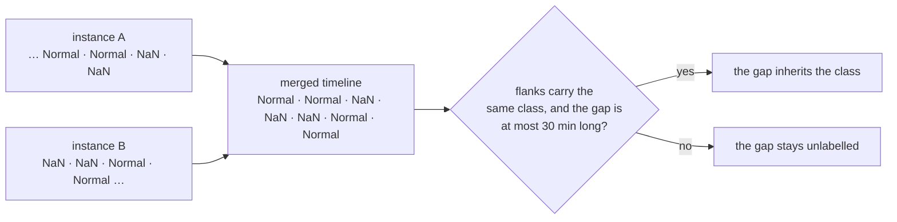

# New behaviors of the feature extractor

This document is related to the ideas report of 2026-09-27
([`2026-09-27_out-of-well_generalization.md`](2026-09-27_out-of-well_generalization.md)). While
that report discusses next steps for the development of the project, this one lays out a new modus
operandi for feature dataset creation (today `scripts/01_build_features.py`, `flowml.preprocessing`
and `flowml.features`). The order of work was inverted after the first review: the dataset rebuild
described here comes first; a separate document will then cover retiring parts of the current
train/validation/test pipeline; the pipeline items of the 2026-09-27 report (synthetic instances as
training-only groups, label-shift correction, well-history normalization, ExtraTrees and well
bagging, stacking by view) come after both.

§1 gives the facts the design rests on, measured on the raw data by the audit written for this
document. §2 is the design as agreed. §3 and §4 quote the review comments of the three rounds and
answer them. §5 describes the prototype and what its smoke test produced. §6 lists what is still
open.

---

## 1. What the raw data says

The claims of the first draft — that overlapping instances of a well never disagree, that merging
them takes 3W from about 1,100 real instances to about 200 recordings, and that the label gaps
inside the merged timelines are thin — were checked on every real instance of 3W 2.0.0 by
[`scripts/audits/well_instances_auditing.py`](../scripts/audits/well_instances_auditing.py), which
now folds the overlap checks into the per-well listing it always produced. Artifacts:
[`results/audits/well_instances_20260928_163916.txt`](../results/audits/well_instances_20260928_163916.txt)
(the listing, every table, and the list of long gaps) and
[`results/audits/well_instances_20260928_163916.pdf`](../results/audits/well_instances_20260928_163916.pdf)
(five pages: instances against recordings per well, the overlap agreement, recording lengths, gap
lengths per class, gaps against the recordings that hold them).

**Merging.** Instances of a well that overlap or touch (a gap of at most one second) were joined
into recordings.

| merge                                                    |                  value |
| -------------------------------------------------------- | ---------------------: |
| real instances → recordings                             |           1,119 → 208 |
| rows → unique samples                                   |       32.9 M → 29.7 M |
| recordings drawing from more than one fault-class folder | 1 (well 6, §3 item 4) |
| recording length, median / p90 / max                     |   20 h / 103 h / 226 h |

**Agreement.** On the timestamps shared by two or more instances of the same well:

| shared timestamps                                               |       count |
| --------------------------------------------------------------- | ----------: |
| labelled in one instance only (the other is unlabelled)         |   3,159,450 |
| unlabelled in all                                               |       1,576 |
| labelled in all, equal                                          |          13 |
| labelled in all,**different**                             | **0** |
| key-sensor readings that differ (8 sensors, 15.8 M comparisons) | **0** |

So the merge rule is "take the non-NaN label", and no conflict policy is needed. The rationale
written into `preprocessing.select_instances` — that the shared samples carry different labels,
"the steady fault state in the earlier instance, normal operation in the later one" — is wrong:
they are labelled in exactly one of the two.

**Gaps.** Unlabelled runs inside contiguous 1 Hz stretches of the merged timelines, by what sits on
their two sides, and — added in the second round — by how long they are relative to the recording
that holds them:

| gap kind                                                          | count | length, median / p90 / max | share of its recording, median / p90 / max |
| ----------------------------------------------------------------- | ----: | -------------------------- | ------------------------------------------ |
| same class both sides, Normal                                     |   544 | 107 s / 307 s / 3,360 s    | 0.024 % / 0.135 % / 5.29 %                 |
| same class both sides, Flow Instability                           |   313 | 45 s / 108 s / 232 s       | 0.020 % / 0.077 % / 0.31 %                 |
| same class both sides, Severe Slugging                            |    25 | 83 s / 226 s / 330 s       | 0.072 % / 0.185 % / 0.57 %                 |
| different classes (all of them transitions into or out of Normal) |    16 | —                         | —                                         |
| one flank only (the edge of a contiguous stretch)                 |   208 | —                         | —                                         |

Three things follow. The same-class rule only ever fires in classes 0, 3 and 4, so it never touches
the transient or steady periods of the classes that have normal prefixes. The gaps are not all
thin in absolute terms — 58 of the 882 same-class gaps are 5 minutes or longer, the longest 56
minutes (well 33) — and most of the long ones end at the top of an hour, where one instance's
labels stopped a few minutes before its nominal end and the next instance's labels start at the
hour: the seams of the manual labelling. Relative to their recordings, though, they are all small:
only two Normal gaps exceed 1 % of the recording they sit in, and the p90 is about a tenth of a
percent.

---

## 2. The design as agreed

```mermaid
flowchart LR
  RAW[("3W dataset<br/>1,119 real + 1,109 synthetic files")] --> REC["reconstruction<br/>merge overlaps · relabel gaps ≤ 30 min<br/>split multi-folder recordings"]
  REC --> MER[("data/merged/<br/>real recordings in 3W's layout<br/>manifest.json: events + provenance")]
  MER --> EXT["extraction<br/>windows of L s, overlap R<br/>statistics · flags · running stats · metadata"]
  RAW -.->|"synthetic instances,<br/>unchanged"| EXT
  EXT --> FEAT[("data/features_w512_o0.parquet<br/>+ features_w512_o0.json")]
  FEAT --> PIPE["train / validation / test pipeline<br/>run.json records the manifest hash"]
  style REC fill:#000000
  style EXT fill:#000000
```



### 2.1 Decoupling from the pipeline

Feature building is a package inside this repository — `flowml.dataset`, with `reconstruction`
and `extraction` modules, the way `flowml.visualization` is a package — not a second repository.
The coupling point (a run must know which dataset it read) is solved by a **manifest**: every
artifact gets a sidecar JSON with the 3W version read from `dataset.ini`, the parameters it was
built with, its totals and the code's git commit, and the features manifest also carries the hash
of the reconstruction manifest it was built from; `run.json` and `results/index.jsonl` will record
the features manifest's hash. A separate repository earns its keep only if something outside this
pipeline consumes the reconstruction, and a uv workspace can split the package out later without
changing the layout.

### 2.2 No more instance overlap

The reconstruction is a cached, deterministic artifact under `data/` (git-ignored), rebuilt on
demand and described by its manifest; the whole real part comes to 421 MB on disk and building it
takes about four minutes (§5).

- **Merge rule.** Real instances of a well that overlap or touch in time are one recording; on a
  shared timestamp the label is the one non-NaN value (§1 shows there is never more than one) and
  the readings are identical. Every recording is reindexed to a complete 1 Hz grid (the audit
  found no missing second, but the extractor must never cut a window across one). Simulated and
  hand-drawn instances have no well and are not copied: the extraction reads them from 3W as they
  are.
- **Label rule for gaps.** An unlabelled run inside a recording inherits the class of its flanks
  when both flanks carry the same class — Normal included, so *normal, NaN, normal* becomes
  normal — and stays unlabelled when they differ or when it has one flank only. The rule is
  bounded by `--gap-relabel-max`, **30 minutes** by decision of the second round: of the gaps
  beyond the p90 that were inspected in the viewer, only the 56-minute one of well 33 shows a
  genuine change of dynamics inside it, and 30 minutes leaves it unlabelled while relabelling every
  other gap in the dataset. Every relabel is counted in the manifest, per recording and per class.



- **Layout.** Folders stay split by fault class and file names keep 3W's convention
  (`WELL-<id>_<start>.parquet`), labels as nullable `Int16` like 3W, sensors as `float64`. A
  recording whose instances come from different fault-class folders is split at the first
  labelled sample after the earlier event's last sample, so the unlabelled stretch between the
  events stays with the earlier part and the later part starts on its own prefix (§3 item 4 has
  the one case); each part goes to its own folder. The `events` (the runs of each recording's
  labels) and the `provenance` (which 3W files each recording came from) live **inside the
  manifest**, by decision of the second round — one JSON per reconstruction, one entry per
  recording.
- **Source switch.** `--source merged` (default) reads the reconstruction, `--source original`
  reads 3W's files as they are; `--raw-dir` keeps pointing at the local 3W copy in both cases,
  since the reconstruction is built from it and the synthetic instances are always read from it.

### 2.3 No more window overlap

Windows are cut on the recording's 1 Hz grid and never across a discontinuity, and every row
stores the window's first and last timestamps rather than a row index. The length is an argument
in seconds (3W is 1 Hz, so seconds are samples; any other source would have to be resampled
first), consecutive windows do not overlap by default, and each (length, overlap) pair gives one
parquet named after it — `features_w512_o0.parquet` — with its manifest beside it. Several lengths
in one run give one parquet each, all cut from the same grid, which keeps a later multi-scale join
possible without designing it now.

A window is one operating condition, so it must be **fully labelled** and must not **mix normal
with abnormal operation**: a window with any unlabelled sample is dropped, and so is a window that
holds both class 0 and a fault label. A window that mixes a fault's transient and steady samples is
kept and carries the majority label. Under this rule no purity metadata is needed, and the
extractor counts what it dropped, per reason, in the features manifest.

**Window length candidates.** Vargas's expert horizons (thesis, Table 1) rounded to the nearest
power of two, and what each length means on the 208 merged recordings:

| horizon (Vargas)                                         | expert     | nearest 2^k     | recordings at least that long | non-overlapping windows over the real recordings |
| -------------------------------------------------------- | ---------- | --------------- | ----------------------------: | -----------------------------------------------: |
| DHSV closure, low end                                    | 5 min      | 2^8 = 4.3 min   |                         100 % |                                          115,948 |
| *(candidate)*                                          | —         | 2^9 = 8.5 min   |                         100 % |                                           57,923 |
| flow instability, PCK restriction, DHSV closure high end | 15–20 min | 2^10 = 17.1 min |                         100 % |                                           28,912 |
| hydrate, low end                                         | 30 min     | 2^11 = 34.1 min |                         100 % |                                           14,402 |
| severe slugging, hydrate high end                        | 5 h        | 2^14 = 4.6 h    |                          82 % |                                            1,709 |
| BSW increase, productivity loss                          | 12 h       | 2^15 = 9.1 h    |                          67 % |                                              803 |
| PCK scaling                                              | 72 h       | 2^18 = 72.8 h   |                          17 % |                                               51 |

512 s stays the tentative default: it sits between the shortest horizon and the 15-minute group,
and yields about 58,000 real windows. The long horizons cannot be window lengths — fewer than a
thousand windows, and a third of the recordings too short for 2^15 — and belong to the trend and
context features of the 2026-09-27 report instead, computed over a long past on top of short
windows.

### 2.4 Flags

| flag                      | options                   | what it does                                                                                                                                                | default                           |
| ------------------------- | ------------------------- | ----------------------------------------------------------------------------------------------------------------------------------------------------------- | --------------------------------- |
| `--raw-dir`             | a path                    | root of the local 3W dataset, used to build the reconstruction and to read the synthetic instances                                                          | `FLOWML_RAW_DATA_DIR` or config |
| `--source`              | `merged`, `original`  | which real instances to extract from: the reconstructed recordings (built and cached on demand) or 3W's files as they are                                   | `merged`                        |
| `--max-instances`       | `N`                     | cap instances per fault folder**and per source** (real, simulated, hand-drawn counted apart), for a smoke test; the artifacts get an `_n<N>` suffix | all                               |
| `--keep-extreme-values` | none                      | keep the readings that cannot be measurements instead of masking them as missing (dropping rows would break the timeline)                                   | masked                            |
| `--window-length`       | `L` seconds, repeatable | length of the windows; several values give one parquet each                                                                                                 | 512 (~8.5 min)                    |
| `--window-overlap`      | `R` in [0, 100)         | overlap of consecutive windows, in percent                                                                                                                  | 0                                 |
| `--gap-relabel-max`     | seconds                   | longest unlabelled gap that inherits its flanks' common class; 0 disables the rule, -1 removes the bound                                                    | 1800 (30 min)                     |
| `--sensors`             | comma-separated           | the variables that get window statistics; valve states and choke openings are left out for now, by decision of the second round                             | the 8 key sensors                 |
| `--output-dir`          | a path                    | where the reconstruction, the parquets and the manifests go                                                                                                 | `data/`                         |
| `--rebuild-merged`      | none                      | rebuild the reconstruction even when one with the same parameters is present                                                                                | reuse it                          |
| `--skip-extraction`     | none                      | stop after the reconstruction, for building`data/merged/` on its own                                                                                      | extract                           |

Retired: `--allow-overlap` (instances no longer overlap) and the `--window-fallback K` of the
first draft, which became a load-time choice of the train pipeline once the running statistics of
§2.5 are stored.

### 2.5 Columns: keys, features, references, metadata

The parquet keeps four kinds of columns, and the distinction is the deployability rule of §3
item 7: **a feature is something a deployed model can compute from the signals and the well's own
past; anything that needs the labels is metadata, never an input.** The features manifest lists
the columns of each group, and the loader will enforce the split the way `META_COLS` is excluded
today.

| group      | columns                                                                                                                                                      | notes                                                                                                                                                                                                                                                                                                                                                                                       |
| ---------- | ------------------------------------------------------------------------------------------------------------------------------------------------------------ | ------------------------------------------------------------------------------------------------------------------------------------------------------------------------------------------------------------------------------------------------------------------------------------------------------------------------------------------------------------------------------------------- |
| keys       | `recording_id`, `well_id`, `source_type`, `window_start`, `window_end`, `n_valid`                                                                | `recording_id` replaces `instance_id`; timestamps, not row indices; `n_valid` counts the critical sensor's valid samples                                                                                                                                                                                                                                                              |
| features   | the 11 statistics per sensor;`<sensor>_frozen` and `<sensor>_missing`; `state_mode`; `time_since_start`                                              | the flags are computed at build time now that they are features in their own right;`state` is an operational status available online; the ratio and burn-in-relative features of the 2026-09-27 report remain load-time transformations of these                                                                                                                                          |
| references | `run__<sensor>_n`, `run__<sensor>_mean`, `run__<sensor>_var`: the **causal running statistics** of the recording up to the window's first sample | the burn-in reference of*K* windows is the running statistics at window *K*, the whole-history reference is the current window's own, so `--normalization well-history` and the burn-in length become train-pipeline switches; the two references stored today (`instance`, `normal`) both need the labels or the future and are proposed for retirement in the pipeline document |
| metadata   | `fault_class` (the folder), `window_label` (the majority label), `time_to_event`, `time_since_event`                                                 | never fed to a model;`time_to_event` defines the prediction target's horizon and the lead-time metrics (§3 item 7)                                                                                                                                                                                                                                                                       |

---

## 3. First review round, answered

> **Item 1.** *Please consider merging `overlap_conflicts.py` in the scratchpad into my own
> `well_instances_auditing.py` audit script. Also introduce any plots you find adequate for
> presenting the information in your report (pie/bar charts, histograms, etc.). Keep an aesthetic
> similar to other audit scripts.*

Done. The audit keeps its per-well listing (file, span, folder, an *overlaps* mark) and its
`--well-ids` and `--quiet` switches, gains `--raw-dir`, `--gap-list-min` and `--output-dir`, and
writes a text report and a PDF under `results/audits/` in the style of the sensor-distributions
audit: bars for instances against recordings per well, a row of numbers for the overlap agreement
(the numbers are the finding, so no chart is drawn around them), a histogram of recording lengths,
histograms of the same-class gap lengths in the repository's fault colors with the p90 and the
`--gap-list-min` marked, and — since the second round — the gaps against the recordings that hold
them. Bars and histograms rather than pies, which compare close values poorly. The README's audit
table has the new row.

> **Item 2.** *I did mean that NaN-labelled records would inherit the label of their flanks as long
> as these labels agreed, so NaN would become normal in "normal, NaN, normal". I am surprised to
> find that gaps can be so large. Please give me a list of the instances above the ~5 min p90 so I
> can take a look with the viewer and confirm whether `--gap-relabel-max` is necessary. My
> impression is that the bigger gaps are still okay to relabel; if I'm wrong, I agree to a
> reasonable max (i.e., p90).*

The rule is recorded that way in §2.2. The list is in the audit's text report, under "same-class
gaps of at least 300 s, longest first": 58 gaps, each with its well, class, start and end, length,
share of its recording, and the two instances that cover it; `--gap-list-min` changes the cutoff.
The inspection happened in the second round (§4 item 1) and fixed the bound at 30 minutes.

> **Item 3.** *Decoupling: very reasonable, agreed.*

Recorded in §2.1.

> **Item 4.** *I don't understand the connection between the table and solving the convention for
> the multiple-fault instance case (if I remember correctly, it's an overlap that starts as abrupt
> increase of BSW and ends with closure of PCK). To which folder is this overlap-free instance
> going? Or do you suggest changing the 3W fault-class directory structure?*

The first draft suggested a neutral layout with an events table, which was more than the case
needs; §2.2 keeps 3W's folders. The recording is the one the audit lists: well 6, from
`WELL-00006_20180617190257` (folder 1) and `WELL-00006_20180618103000` (folder 7), 52 hours:

```mermaid
flowchart LR
  U1["unlabelled<br/>1.0 h"] --> N1["Normal<br/>12.0 h"] --> T1["Abrupt BSW Increase<br/>transient · 2.7 h"] --> F1["Abrupt BSW Increase<br/>0.2 h"]
  F1 --> U2["unlabelled<br/>0.5 h"]
  U2 --> N2["Normal<br/>1.5 h"] --> T7["PCK Scaling<br/>transient · 33.2 h"] --> F7["PCK Scaling<br/>0.9 h"]
  S["split here: the left part goes to folder 1,<br/>the right part to folder 7"] -.-> U2
  style U1 fill:#3a3a3a
  style U2 fill:#3a3a3a
  style N1 fill:#0f3d0f
  style N2 fill:#0f3d0f
  style T1 fill:#3d3d0f
  style T7 fill:#3d3d0f
  style F1 fill:#3d0f0f
  style F7 fill:#3d0f0f
```



An Abrupt BSW Increase, then a PCK Scaling (not a PCK closure), separated by an unlabelled half
hour. The rule of §2.2 splits the recording there: the first part goes to folder 1 and keeps its
12-hour normal prefix, the second to folder 7 with the 1.5-hour prefix the data actually gives it.
Nothing is lost, because the two events were separated by a gap the label rule leaves unlabelled
anyway, every recording then sits in exactly one folder, and the events stay as metadata in the
manifest rather than as something the folder layout depends on. It is the only such case in the
dataset, and the prototype's smoke test exercises it (§5).

> **Item 5.** *No more window overlap: yep, yep, yep.*

Recorded in §2.3.

> **Item 6.** *Flags: agreed, down to the naming of the new flag. Regarding the retirement of
> `instance`, I'm planning to retire many things in the current pipeline, and will initialize the
> discussion in its own idea markdown as soon as we're done with this one.*

Recorded in §2.4; the retirements are marked as proposals for that document (§2.5 names the two
references).

> **Item 7.** *I'm torn on including time to/since fault features, as they can't really be used by
> a deployed model where labels aren't available. Still, knowing those times would make for
> interesting analysis. Did you mean to use them as features in the models? If so, what about the
> deployment problem?*

Not as features — as metadata, in the sense §2.5 makes explicit. `time_to_event` exists so that
the train pipeline can *define the target* with a horizon (windows within *H* hours of the next
event carry its class, earlier ones are Normal; with recordings whose prefixes run for days, a
window four days before a hydrate is not a precursor) and so that stage 3 can score lead times;
`time_since_event` is there for analysis. Neither is ever passed to a model, exactly as
`fault_class` and `window_label` are not today, and the loader is what enforces it. What *is*
deployable, and therefore a feature, is what needs no label: `time_since_start` of the recording
and the operational `state`, both known online.

---

## 4. Second and third review rounds, answered

> **Item 1.** *I've taken a look at wells with beyond-p90 label gaps and only well 33 presents a
> meaningful dynamics change in the unknown stretch. As such, 30 minutes seems like a fair limit
> on the maximum size of the gap. With that said, I'd like to see how label gaps distribute not on
> absolute time values, but on the ratio of the duration of the gap relative to the duration of
> the merged instance.*

The bound is 30 minutes (`GAP_RELABEL_MAX_SECONDS = 1800` in the prototype, `--gap-relabel-max`
on the script). The relative view is now the audit's fifth page and its third gap table (§1): the
median same-class gap is two hundredths of a percent of its recording, the p90 about a tenth, and
only two Normal gaps exceed 1 % — the 56-minute one of well 33 at 5.3 %, and one more. On the
scatter of that page the gaps show no relation to the length of the recording that holds them:
long recordings do not have longer gaps, which fits the labelling-seam reading of §1.

> **Item 2.** *The 512 second window is tentative. What do Vargas horizons look like rounded to
> the closest power of 2?*

The table in §2.3. The short horizons round to 2^8 (4.3 min), 2^10 (17 min) and 2^11 (34 min);
the long ones to 2^14 (4.6 h), 2^15 (9.1 h) and 2^18 (72.8 h), and those cannot be window lengths
on this dataset: 2^15 already exceeds a third of the recordings and 2^18 leaves 51 windows in
total. 512 s (2^9) stays as the tentative default, with 1024 and 2048 as the lengths worth building
alongside it when the multi-scale question comes up.

> **Item 3.** *Please do not include valve states and choke openings for now.*

Recorded: `--sensors` defaults to the eight key sensors and nothing else is featurized.

> **Item 4.** *`events` and `provenance` may live inside the manifest. Run a smoke test to
> generate a parquet and manifest (say, N=100) so I can have a better idea of what a full dataset
> would produce.*

Both live inside the reconstruction's `manifest.json`, one entry per recording. The prototype and
its smoke test are §5.

### Third round

> *By plotting label gap duration versus the ratio it occupies, I wanted to see if there is a link
> between the gap presenting dynamics and the duration of the gap; even if gaps are big in absolute
> units, if they are small relative to recording length no meaningful change in dynamics is
> expected.*

That is how the fifth page reads, then: the two Normal gaps above 1 % of their recording are the
only ones where a change of dynamics is plausible, and one of them is the well-33 gap the
inspection flagged; every gap under the 30-minute bound is a fraction of a percent of the
recording that holds it.

> *Windows should not include any unlabelled samples nor mix normal and abnormal operation. Mixing
> transient and steady-state samples is fine. Note that this stricter approach does away with the
> "impurity" metadata.*

Done, in §2.3 and §2.5 and in the extractor: `label_purity` is gone, the two kinds of window are
dropped rather than labelled by majority, a transient-with-steady window keeps the majority label,
and the features manifest reports `windows_dropped` per reason. The smoke test of §5 was re-run
under the new rule.

> *Leave the full 3W reconstruction, which isn't affected by feature extraction, running in the
> background as you make the requested changes on the windowing.*

Started with the 30-minute bound into `data/merged/`; `--skip-extraction` on the script now does
the same. Its manifest is the reference for the full extraction, whenever that is run.

---

## 5. The prototype and its smoke test

The prototype lives in [`src/flowml/dataset/`](../src/flowml/dataset/) — `reconstruction.py`,
`extraction.py`, `manifest.py` — behind [`scripts/build_dataset.py`](../scripts/build_dataset.py),
with unit tests in [`tests/test_dataset.py`](../tests/test_dataset.py) (merging, gap relabelling,
splitting, window cutting, running statistics, the window rows). The current stage 1 and its
parquet are untouched; the script is not a numbered stage yet, since the numbering belongs to the
pipeline-overhaul document.

```bash
uv run scripts/build_dataset.py --max-instances 100 --verbose   # the smoke test below
uv run scripts/build_dataset.py                                 # the full dataset
```

**What the smoke test produced** (100 instances per fault folder and per source, so every real
folder is fully represented except Normal, Flow Instability and Hydrate in Service Line, which are
capped; the extraction alone took 7 min 14 s on the second run):

| reconstruction (`data/merged_n100/`) |                                                                              value |
| -------------------------------------- | ---------------------------------------------------------------------------------: |
| source instances → recordings         |                                                                         382 → 165 |
| samples                                |                                              19,432,944 (65 % of the real samples) |
| gaps relabelled (seconds)              |                                                                     197 (18,368 s) |
| recordings split                       | 1:`1/WELL-00006_20180617190257.parquet`, `7/WELL-00006_20180618113000.parquet` |
| on disk                                |                                                                319 MB in 165 files |

| extraction (`data/features_w512_o0_n100.parquet`) |                                                                     value |
| --------------------------------------------------- | ------------------------------------------------------------------------: |
| windows                                             |                                                                    80,268 |
| windows dropped                                     | 1,131 with an unlabelled sample, 608 mixing normal and abnormal operation |
| by source                                           |                                WELL 28,326, DRAWN 5,768, SIMULATED 46,174 |
| columns                                             |                     140 (6 keys, 106 features, 24 references, 4 metadata) |
| on disk                                             |                                                                   68.6 MB |

The reconstruction manifest, one recording shown:

```json
{
  "kind": "3w-merged",
  "created": "2026-09-28T16:44:52-03:00",
  "code": {
    "commit": "24dd22eb3365d28472621e79586d6223d4a2959c",
    "short": "24dd22e",
    "branch": "main",
    "dirty": true
  },
  "source": {
    "raw_dir": "..\\3W\\dataset",
    "dataset_version": "2.0.0"
  },
  "parameters": {
    "max_instances_per_class": 100,
    "gap_relabel_max_seconds": 1800,
    "merge_tolerance_seconds": 1
  },
  "totals": {
    "source_instances": 382,
    "recordings": 165,
    "samples": 19432944,
    "missing_seconds_inserted": 0,
    "relabelled_gaps": 197,
    "relabelled_seconds": 18368,
    "split_recordings": 1
  },
  "recordings": [
    "\u2026",
    {
      "file": "1/WELL-00006_20180617190257.parquet",
      "well": 6,
      "folder": 1,
      "start": "2018-06-17T19:02:57",
      "end": "2018-06-18T11:29:59",
      "samples": 59223,
      "missing_seconds": null,
      "source_files": [
        "WELL-00006_20180617190257.parquet",
        "WELL-00006_20180618103000.parquet"
      ],
      "split_from": "WELL-00006_20180617190257.parquet",
      "events": [
        {
          "class": 0,
          "start": "2018-06-17T20:02:57",
          "end": "2018-06-18T08:01:45",
          "seconds": 43129
        },
        {
          "class": 101,
          "start": "2018-06-18T08:01:46",
          "end": "2018-06-18T10:45:28",
          "seconds": 9823
        },
        {
          "class": 1,
          "start": "2018-06-18T10:45:29",
          "end": "2018-06-18T11:00:00",
          "seconds": 872
        }
      ],
      "relabelled": null
    },
    "\u2026"
  ]
}
```

The features manifest, trimmed:

```json
{
  "created": "2026-09-28T17:43:04-03:00",
  "kind": "3w-features",
  "code": {
    "commit": "24dd22eb3365d28472621e79586d6223d4a2959c",
    "short": "24dd22e",
    "branch": "main",
    "dirty": true
  },
  "source": {
    "real_instances": "merged",
    "raw_dir": "..\\3W\\dataset",
    "merged_manifest": {
      "path": "H:\\projetos\\flow-assurance-ml\\data\\merged_n100\\manifest.json",
      "sha256": "95e8aaeae2a3ea62361744cfa1a9a728f2a369bceb9af836a919d1a6ef751925",
      "created": "2026-09-28T16:44:52-03:00"
    }
  },
  "parameters": {
    "window_length_seconds": 512,
    "window_overlap_percent": 0,
    "sensors": [
      "P-PDG",
      "T-PDG",
      "P-TPT",
      "T-TPT",
      "P-MON-CKP",
      "T-JUS-CKP",
      "P-JUS-CKGL",
      "QGL"
    ],
    "keep_extreme_values": false,
    "max_instances_per_class": 100
  },
  "output": {
    "parquet": "features_w512_o0_n100.parquet",
    "size_bytes": 68643913,
    "windows": 80268,
    "windows_by_source": {
      "WELL": 28326,
      "DRAWN": 5768,
      "SIMULATED": 46174
    },
    "windows_by_fault_class": {
      "0 Normal": 3064,
      "1 Abrupt BSW Increase": 15182,
      "2 Spurious DHSV Closure": 1195,
      "3 Severe Slugging": 9423,
      "4 Flow Instability": 1687,
      "5 Rapid Productivity Loss": 6318,
      "6 Quick PCK Restriction": 5196,
      "7 PCK Scaling": 16432,
      "8 Hydrate in Production Line": 9702,
      "9 Hydrate in Service Line": 12069
    },
    "windows_dropped": {
      "unlabelled": 1131,
      "mixed_operation": 608
    },
    "recordings_featurized": 728,
    "recordings_dropped_by_quality_gate": 28
  },
  "columns": {
    "keys": "6 columns",
    "features": "106 columns",
    "references": "24 columns",
    "metadata": "4 columns"
  }
}
```

**The full reconstruction** ran on 2026-09-28 into `data/merged/` with the 30-minute bound: the
1,119 real instances became 209 recordings (208 merged, one of them split) holding 29,709,635
samples — exactly the unique samples the audit counted — with 881 gaps relabelled for 96,623 s
(543 Normal, 313 Flow Instability, 25 Severe Slugging: every same-class gap but the one of well 33),
no missing second inserted, 421 MB in 209 files, about four minutes of runtime. Its manifest is
the reference for the full extraction.

**Projection of the full extraction.** The smoke run covers 65 % of the real samples; at that rate
the 512 s parquet has about 140,774 windows (43,306 real and 97,468 synthetic; the
grid would allow 57,923 real windows, but the windows with an unlabelled sample or mixing normal
and abnormal operation are dropped) and about 120 MB, against the 443,000 rows and 231 MB of
today's 300 s / 150 s parquet.

**What the prototype does not do yet.** The train pipeline does not read the new parquet (the
loader that honours the four column groups and records the manifest hash is pipeline-overhaul
work); `--source original` and several `--window-length` values are implemented but were not part
of the smoke test; the reconstruction has no test on real data beyond this run, so the full build
should be followed by the well-instances audit pointed at `data/merged/` once the audit learns to
read a reconstruction.

---

## 6. Open decisions

The default window length: 512 s stays tentative; 1024 and 2048 are the candidates to build
alongside it (§2.3).

The horizon *H* that turns `time_to_event` into the prediction target — a pipeline-overhaul
decision, but the reconstruction's prefixes (median 20 h, p90 103 h) are the numbers to decide
it with.

When to run the full reconstruction and extraction, and whether the well-instances audit should
gain a `--merged-dir` switch to verify the result.

Then the pipeline-overhaul document, and after it the pipeline items of the 2026-09-27 report in
the order given there.
