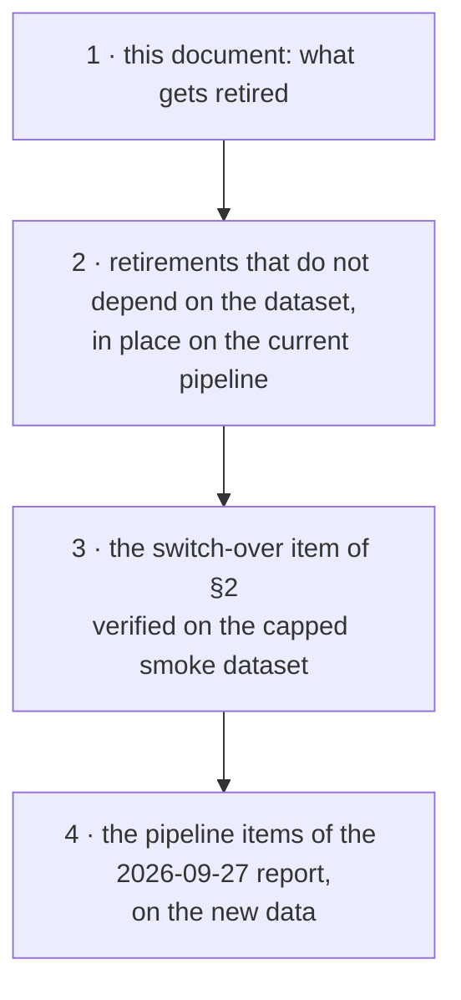

# Overhauling the train/validation/test pipeline

**Date (created):** 2026-09-28. **Status:** planning document, initialized from a planning question;
nothing here is decided beyond the migration strategy of §1.

This document follows
[`2026-09-28_new_feature_dataset.md`](2026-09-28_new_feature_dataset.md), which replaces stage 1
with a reconstruction of 3W's real instances and a new windowing, and precedes the pipeline items of
[`2026-09-27_out-of-well_generalization.md`](2026-09-27_out-of-well_generalization.md). Its job is
to decide what the current pipeline keeps, what it retires, and in which order the new dataset
takes over.

---

## 1. Migration strategy: switch at the seam, delete in the same step

> *The `build_dataset.py` script seems like, for all intents and purposes, the new version of
> `01_build_features.py`. Should the old scripts be edited as we move along the pipeline, or
> should we wait until all the new scripts are up and running so the old ones can be deleted?*

Neither extreme. Stage 1 is replaced in a single switch-over step, and the old script is deleted in
that same step, without being edited in the meantime. Stages 2 to 5 are a different case: they are
being simplified rather than replaced, so they are edited in place as this document retires things.

**Why not edit the old stage 1 as we go.**

- The new builder is a different design, not a revision. It reconstructs recordings and then
  windows them, where the old one selects instances and windows each one. Editing the old script
  would grow a second copy of the new builder inside a file that is going away, and every change
  would be reviewed twice.
- Left untouched, the old script keeps generating the baseline that all five reports under
  `results/reports/` cite, so the first run on the new data has trusted numbers to be compared
  against.

**Why not wait until everything is new.**

- Only stage 1 needs a new version. Search, evaluation, interpretation and distillation work, and
  writing fresh copies of them adds rewrite risk for no gain.
- A long stretch with two pipelines means two sets of flags, drift between them, and a final
  deletion far too large to review as one unit.
- Deleting loses nothing. Git keeps the old code, and every run directory records the commit and
  the diff it ran on, so the old results stay reproducible without the old scripts in the tree.

```mermaid
flowchart LR
  subgraph NOW["today"]
    direction TB
    O1["01_build_features.py"] --> OP[("features_overlap.parquet")]
    N1["build_dataset.py (prototype)"] --> NP[("features_w512_o0.parquet")]
    OP --> L["train_val_test.load_task_data"]
  end
  subgraph AFTER["after the switch"]
    direction TB
    S1["01_build_dataset.py"] --> NP2[("features_w512_o0.parquet")]
    NP2 --> L2["load_task_data, new schema"]
  end
  NOW -->|"one item: loader switched,<br/>prototype promoted,<br/>old stage 1 deleted"| AFTER
  style NOW fill:#000000
  style AFTER fill:#000000
```

---

## 2. Where the switch happens

The parquet's layout is known to one loader and to three direct readers:

| reads the features parquet | through |
|---|---|
| [`02_train_val_test.py`](../scripts/02_train_val_test.py), [`04_interpret.py`](../scripts/04_interpret.py), [`05_decision_tree.py`](../scripts/05_decision_tree.py) | `train_val_test.load_task_data` |
| [`split_composition_auditing.py`](../scripts/audits/split_composition_auditing.py) | `load_task_data` |
| [`well_leakage_auditing.py`](../scripts/audits/well_leakage_auditing.py) | `load_task_data` and `config.features_path` |
| [`well_identifiability_auditing.py`](../scripts/audits/well_identifiability_auditing.py) | `config.features_path` |
| [`main.py`](../main.py) | `config.features_path`, to decide whether stage 1 runs |

Stage 3 reads stage 2's predictions, never the parquet. So the switch is one bounded item:

- the loader learns the new column names and the four column groups of the features manifest
  (keys, features, references, metadata), and never passes a metadata column to a model;
- `recording_id` replaces `instance_id` as the instance-level grouping key;
- the build-time `<sensor>_frozen` flags stop colliding with the frozen-sensor policy, which today
  computes and adds the same columns at load time;
- the prototype becomes the numbered stage 1, and `main.py` calls it;
- the old stage 1 is deleted together with the overlap machinery it alone needs
  (`--allow-overlap`, the `_overlap` suffix, `preprocessing.select_instances` and its lane
  packing, which the fault-timeline plot still shares and keeps).

If the item turns out too big to review at once, it splits cleanly: first the loader reads the new
parquet with normalization off, then the references built on the running statistics follow.

---

## 3. Order of work

1. **This document**, listing what gets retired (§4).
2. **The retirements that do not depend on the dataset**, done in place on the current pipeline.
   Each one shrinks what the switch has to carry. The whole-recording normalization reference is
   the obvious first, since the new parquet will not provide it.
3. **The switch-over item** of §2, verified on the capped smoke dataset (`--max-instances`), not on
   the full one.
4. **The pipeline items of the 2026-09-27 report**, run on the new data.

---

## 4. Retirement candidates (to be decided)

Collected from the earlier documents and reports; none is decided yet.

| candidate | why it is a candidate | where it was raised |
|---|---|---|
| `--normalization instance` | the whole-recording reference leaks the coming fault, and the new parquet has no equivalent | TODO item 9; new-dataset document §2.5 |
| `--normalization normal-operation-values` | needs the labels to pick the normal samples; the running statistics give a causal alternative | new-dataset document §2.5 |
| `--allow-overlap` and the `_overlap` artifacts | instances no longer overlap after the reconstruction | new-dataset document §2.4 |
| `--frozen-sensors drop` | removes 4 % of windows, cannot be compared on equal rows, and the flags are now built into the parquet | frozen-sensors report §8 |
| the instance-grouped protocol as a reported result | a well look-up rather than generalization; kept, if at all, only as a diagnostic | out-of-well document §2.2 |
| `normalization_leakage_auditing.py` | documents a mechanism that the first two retirements remove | this document |

---

## 5. Open decisions

1. Which of the §4 candidates are retired, and in which order.
2. Whether the switch-over item is split in two as §2 suggests.
3. The name and number of the promoted stage 1 (`01_build_dataset.py` is used above as a
   placeholder).
