# Per-instance normalization, with the leak separated out

**Exploration goal.** Report 1 (`2026-09-17_normalization_and_groupings.md`) found that
per-instance z-scoring helped the fault-prediction task, and then found that the z-scoring was
leaking the coming fault into the features. It could not say how much of the help was the leak,
because the two were the same switch: normalization was baked into the features parquet, and the
only reference available was the whole recording — fault period included.

TODO item 9 separated them. Stage 1 now writes **raw** features and stores, per instance and
sensor, the mean and standard deviation of each candidate reference beside them; a run picks one at
load time. That makes the decomposition a matter of running three configurations instead of
building three datasets:

| `--normalization` | reference | contains the fault period? |
|---|---|---|
| `none` | — (raw features) | n/a |
| `instance` | mean, σ over the **whole recording** | **yes** — this is the leak, and reproduces the old behaviour exactly |
| `normal-operation-values` | mean, σ over the instance's **normal-operation samples only** | no |

So `instance − normal-operation-values` isolates the leak, and
`normal-operation-values − none` isolates whatever per-instance normalization is worth on its own.

**The headline answer: the leak was not the whole story, and report 1's central claim does not
replicate.** Normalization has a large genuine benefit *and* a leak on top — in roughly equal
measure on the 8-class question with shared wells (+0.059 genuine, +0.036 leak), but the split
depends on the question. On the hard combination of unseen wells and the coarse triage question the
leak is worth two and a half times the honest half (§6), which is the setting closest to
deployment and the one where the leak is least available.

---

## 1. What was run

36 runs: 3 normalization references × 3 frozen-sensor policies × 2 CV groupings × 2 label sets.
This report reads the normalization axis; the other two have reports of their own
(`2026-09-21_frozen_sensors_and_instrument_status.md`,
`2026-09-21_cv_grouping_and_well_generalization.md`).

```bash
uv run main.py --model xgb --task prediction --allow-overlap --skip-permutation \
  --cv-group {instance_id,well_id} [--eval nested] \
  --normalization {none,instance,normal-operation-values} \
  --frozen-sensors {keep,flag,drop}
```

- **Dataset**: `data/features_overlap.parquet`, built at commit `4a59209` with `--allow-overlap`.
  442,943 windows total; the prediction task keeps the 100,184 with `window_label == 0`, over 1,107
  instances and 35 wells (33 real wells once the well grouping drops synthetic data).
- **Protocol**: `holdout` for instance grouping (its default), `nested` with 5 outer folds for well
  grouping. Leave-one-out is the documented default for well grouping but costs ~33 inner searches
  per run — about 11 h of CPU for nine runs — so nested was used instead. Scores are therefore
  **not comparable across the two groupings**; see report 3.
- **Label sets**: every configuration was run on the dataset's own 8 classes and again on the
  `hydrate` grouping (Normal / Other Problem / Hydrate), so §6 can report the `native` vs
  `collapse` comparison of reports 1 and 2. `native` is a model *trained* on the three groups;
  `collapse` is the 8-class model's predictions mapped onto them afterwards, which costs no
  training — it re-scores the same held-out windows.
- Permutation importance was skipped (`--skip-permutation`); SHAP is the reference ranking, as in
  the earlier reports.

---

## 2. Headline metrics

F1-macro on held-out data. Rows are the normalization reference; the three frozen-sensor policies
are shown so the reader can see the normalization effect is not an artefact of one of them.

### Instance grouping (holdout, 100,184 windows)

| normalization | keep | flag | drop | mean |
|---|---|---|---|---|
| `none` | 0.8210 | 0.8334 | 0.8547 | **0.836** |
| `normal-operation-values` | 0.8994 | 0.8774 | 0.9078 | **0.895** |
| `instance` (leaky) | 0.9450 | 0.9423 | 0.9045 | **0.931** |

### Well grouping (nested, 82,115 windows, 33 wells)

| normalization | keep | flag | drop | mean |
|---|---|---|---|---|
| `none` | 0.2816 | 0.2249 | 0.1938 | **0.233** |
| `normal-operation-values` | 0.2965 | 0.2368 | 0.3414 | **0.292** |
| `instance` (leaky) | 0.3905 | 0.3781 | 0.4063 | **0.392** |

The ordering `none < normal-operation-values < instance` holds under **both** groupings and under
every frozen-sensor policy but one (`instance/drop` under instance grouping, 0.9045, sits below
`normal-operation-values/drop`, 0.9078). That consistency is the main reason to believe the
decomposition rather than the noise.

```mermaid
flowchart LR
  A["none<br/>0.836"] -->|"+0.059<br/><b>genuine</b>: removes the well's<br/>operating point"| B["normal-operation-values<br/>0.895"]
  B -->|"+0.036<br/><b>leak</b>: divisor encodes<br/>the coming fault"| C["instance<br/>0.931"]
  style A fill:#1b3a1b
  style B fill:#3a3a1b
  style C fill:#3a1b1b
```



**Instance grouping, mean over the three frozen policies: the leak is worth +0.036 F1-macro and
honest normalization +0.059.** Report 1 attributed essentially all of the benefit to the leak. That
is wrong: most of it survives when the fault period is removed from the reference.

---

## 3. Where the leak actually lives

The divisor inflation is now a property stored in the dataset, so it can be read off the parquet
instead of re-derived from the raw recordings: per instance and sensor,
σ(whole recording) / σ(normal operation only). Median over the eight key sensors and the instances
of each class, with the per-class recall decomposition from the `keep` runs under instance grouping
(identical rows in all three, so the recalls are directly comparable):

| class | instances | median inflation | p90 | recall `none` | `normal-op` | `instance` | genuine | leak |
|---|---|---|---|---|---|---|---|---|
| 0 Normal *(control)* | 537 | **1.04** | 1.4 | 1.000 | 0.996 | 0.994 | −0.004 | −0.002 |
| 9 Hydrate in Service Line | 40 | 1.17 | 5.6 | 1.000 | 1.000 | 0.996 | +0.000 | −0.004 |
| 6 Quick PCK Restriction | 6 | 1.90 | 12.3 | 0.988 | 0.964 | 0.966 | −0.024 | +0.002 |
| 7 PCK Scaling | 31 | 1.97 | 8.8 | 0.783 | 0.708 | 0.838 | −0.075 | +0.129 |
| 8 Hydrate in Production Line | 9 | 29.10 | 175.4 | 0.501 | 0.770 | 0.795 | **+0.269** | +0.025 |
| 2 Spurious DHSV Closure | 21 | 372.35 | 2192.5 | 0.327 | 0.729 | 0.991 | **+0.402** | **+0.262** |
| 1 Abrupt BSW Increase | 128 | 1275.21 | 17345.1 | 0.676 | 0.766 | 0.838 | +0.090 | +0.071 |
| 5 Rapid Productivity Loss | 335 | 1313.51 | 22560.2 | 1.000 | 0.953 | 0.997 | −0.047 | +0.044 |

**The control behaves exactly as the leak hypothesis predicts.** Normal-operation instances have no
fault period to inflate the divisor — inflation 1.04 — and they gain nothing from either half
(−0.004, −0.002). This is the single cleanest piece of evidence in the report, and it is the one
finding of report 1 that replicates without qualification.

**Report 1's monotonicity claim does not replicate.** Report 1 reported Spearman ρ = 1.000 across
the four classes with headroom and ρ = 0.833 (p = 0.010) across all eight, between the divisor
inflation and the recall gain from z-scoring. On the bugfixed pipeline:

| correlation | ρ | p | n |
|---|---|---|---|
| inflation vs **leak** gain (`instance − normal-op`) | +0.690 | 0.058 | 8 |
| inflation vs **genuine** gain (`normal-op − none`) | +0.143 | 0.736 | 8 |
| inflation vs **combined** gain (`instance − none`, report 1's quantity) | +0.619 | 0.102 | 8 |
| combined gain, classes with headroom only | +0.400 | 0.600 | 4 |

The direction is right and the leak correlates better with inflation than the genuine half does —
which is what the mechanism predicts — but nothing here is significant at 0.05, and the
headroom-only figure collapses from 1.000 to 0.400. Two reasons to expect this, both worth stating
plainly:

1. **The per-class recalls are estimated on very few instances.** Quick PCK Restriction has 6
   instances, Hydrate in Production Line 9, Spurious DHSV Closure 21. A single instance landing on
   the wrong side of the split moves a per-class recall by a large fraction.
2. **Report 1 correlated the combined quantity**, since it had no way to separate the halves. Its
   ρ = 0.833 is the row marked "combined" above, which is now +0.619. Part of the drop is the
   different dataset (this run uses the overlap build) and part is that the decomposition reveals a
   genuine component that dilutes the relationship.

The honest summary: **the leak is real, its size is largest where the inflation is largest, and the
Normal control confirms the mechanism — but the rank correlation across eight classes is too noisy
to carry the weight report 1 put on it.**

---

## 4. What the model looks at

Top-10 SHAP features, `--frozen-sensors keep`, so the frozen-sensor indicators do not crowd the
list (they are the subject of report 2):

| run | top-10 |
|---|---|
| instance, `none` | `T-TPT_min`, `T-TPT_max`, `P-TPT_max`, `P-MON-CKP_max`, `P-TPT_min`, `P-JUS-CKGL_max`, `P-MON-CKP_min`, `P-PDG_median`, `P-TPT_mean`, `T-JUS-CKP_mean` |
| instance, `instance` | `T-TPT_diff2_std`, `P-TPT_max`, `P-TPT_min`, `T-TPT_min`, `P-MON-CKP_min`, `QGL_max_zscore`, `T-TPT_std`, `T-JUS-CKP_std`, `T-TPT_max`, `QGL_std` |
| instance, `normal-operation-values` | `P-PDG_diff2_std`, `T-JUS-CKP_std`, `T-TPT_diff2_std`, `T-JUS-CKP_diff2_std`, `QGL_std`, `P-PDG_max_zscore`, `QGL_max_zscore`, `P-TPT_diff2_std`, `T-JUS-CKP_diff1_std`, `T-TPT_diff1_std` |
| well, `normal-operation-values` | `P-JUS-CKGL_diff2_std`, `T-TPT_diff2_std`, `QGL_diff1_std`, `P-JUS-CKGL_diff1_std`, `P-TPT_diff2_std`, `QGL_iqr`, `T-JUS-CKP_diff1_std`, `QGL_diff2_std`, `T-JUS-CKP_std`, `P-TPT_max_zscore` |

A clean progression, and the most interesting result in this report after the decomposition itself:

- **`none` is entirely levels.** Ten of ten are `_min`, `_max`, `_mean`, `_median` — absolute
  operating points, which is to say, largely well identity.
- **`instance` is a mixture**, and its level entries (`P-TPT_max`, `P-TPT_min`, `P-MON-CKP_min`) are
  exactly the quantities report 2 §6 named as leaky: `(x − instance mean) / instance σ`, both terms
  contaminated by the fault period.
- **`normal-operation-values` is entirely dispersion and derivatives.** Not one level statistic
  appears. Report 2 found this shift only under *well* grouping, where the model is forced off
  absolute levels by the split; here the leak-free reference produces it under instance grouping
  too, and it persists under well grouping.

That is the strongest argument for `normal-operation-values` as a modelling choice: it is the only
setting in which the model ranks the shape of the signal above the operating point without the
grouping having to force it.

The distilled trees agree. Under `none` the root splits are absolute
(`P-PDG_median <= 277.57`, `P-JUS-CKGL_max <= 9072512.50` Pa); under `instance` they are z-scored
levels (`P-TPT_max <= -2.68`, `P-MON-CKP_min <= -3.26`); under `normal-operation-values` the tree
opens on a cascade of dispersion tests (`QGL_std <= 0.01`, `T-JUS-CKP_diff1_std <= 0.00`,
`P-PDG_diff2_std <= 0.00`) — which is a problem in its own right, and the subject of report 2.

---

## 5. Two caveats on `normal-operation-values`

**It is close to circular for the prediction task.** The reference is computed over the instance's
normal-operation samples, and the prediction task models exactly those windows. So each instance's
features are standardized by statistics of (nearly) the rows being standardized. That is not a
label leak — the fault period never enters — but it is not an innocent transform either, and it is
the reason the switch is not the default.

**Its deployment story is different from `instance`'s.** Both need statistics that are not
available from a single window. `instance` needs the whole recording, which online is the future;
`normal-operation-values` needs to know which samples are normal operation. For the prediction
task that is arguably free — the task's premise is that the well is currently in normal operation —
but for detection it is a label, and using it would be circular in the harmful sense. Any use of
this reference for detection needs a separate argument.

---

## 6. Does the ordering survive the triage question?

The same 18 configurations were re-run on the `hydrate` label set — Normal / Other Problem /
Hydrate — in two ways: `native` (trained on the three groups) and `collapse` (the 8-class model's
predictions mapped onto the three groups). Mean F1-macro over the three frozen-sensor policies:

| grouping | strategy | `none` | `normal-op` | `instance` | genuine | leak |
|---|---|---|---|---|---|---|
| instance | 8 classes | 0.8364 | 0.8949 | 0.9306 | +0.059 | +0.036 |
| instance | collapse | 0.9463 | 0.9523 | 0.9621 | +0.006 | +0.010 |
| instance | native | 0.9516 | 0.9519 | 0.9579 | +0.000 | +0.006 |
| well | 8 classes | 0.2334 | 0.2916 | 0.3916 | +0.058 | +0.100 |
| well | collapse | 0.4841 | 0.5171 | 0.6008 | +0.033 | **+0.084** |
| well | native | 0.4030 | 0.4782 | 0.5522 | +0.075 | +0.074 |

Three things follow.

**The ordering `none < normal-operation-values < instance` holds in all six rows.** Six independent
slices — two groupings × three label treatments — and the leak pays in every one. That is much
stronger evidence for the decomposition than §2's single grouping.

**On the easy question it stops mattering.** Under instance grouping the triage task is nearly
saturated (0.946–0.962), and the whole normalization axis compresses into 0.016 of F1-macro; under
`native` it flattens almost entirely (0.9516 / 0.9519 / 0.9579). When the question is coarse and
the wells are shared, how the features are scaled is close to irrelevant.

**Where it still matters, the leak dominates.** On the hard combination — unseen wells, coarse
question, `collapse` — the leak is worth **+0.084** against honest normalization's +0.033: two and
a half times as much. That inverts §2's instance-grouped decomposition (+0.036 leak, +0.059
genuine). The reading is that the genuine half of normalization is largely about making wells
comparable, which the well grouping already demands and partly supplies; what the leak adds is
information about the fault itself, which nothing else supplies. Remove the wells' shared identity
and the leak is most of what is left.

That is a reason for more caution about `instance`, not less. Its advantage is largest exactly in
the setting that most resembles deployment — a well the model has not seen — and that advantage is
unavailable at deployment time, because it is computed from the fault that has not happened yet.

---

## 7. Verdict

1. **The bug is fixed and the old numbers are reproducible.** `--normalization instance` reproduces
   the pre-fix behaviour exactly (verified in `tests/test_normalization.py` against a transcription
   of the removed build-time code), so the leaky baseline remains available for comparison rather
   than being lost.
2. **Report 1 over-attributed — on the 8-class question.** Roughly 62 % of the normalization
   benefit survives the removal of the fault period from the reference (+0.059 of +0.094 under
   instance grouping). "The measured benefit was the leak" — which this author asserted while
   scoping item 9 — was wrong there. But §6 shows the split reverses on unseen wells with the
   coarse question, where the leak is worth +0.084 against +0.033: the attribution depends on the
   question, and no single number covers both.
3. **The leak is nonetheless real and substantial**: +0.036 F1-macro on average, +0.262 recall on
   Spurious DHSV Closure, and zero on the Normal control, exactly as the mechanism predicts.
4. **`none` remains the right default.** It is the only setting with no circularity of any kind,
   and the gap to `normal-operation-values` is the price of that. But the gap is real, and a project
   that wants it should take `normal-operation-values` and argue the circularity — not `instance`.
5. **Do not read the per-class correlations as established.** With 6–21 instances in the
   interesting classes, this sweep cannot settle whether the leak's size tracks the inflation. A
   dedicated experiment with resampling over instances would be needed.

---

## 8. Not done here

- **The `custom` class grouping** (`CUSTOM_CLASS_GROUPING`, a 2-group variant) was not run; §6
  covers `hydrate` only, which is what reports 1 and 2 used.
- **Leave-one-out** on the well half, for the reason given in §1.
- **Permutation importance**, skipped for cost. The SHAP rankings above are unconfirmed by a
  second method.
- **The detection task.** Everything here is `--task prediction`. `normal-operation-values` is the
  reference that matters most for detection, and it is untested there.

---

## Appendix — artifact index

Commit `4a59209`, working tree dirty (the `--normalization` rename of the option formerly called
`normal`; see each run's `changes.diff`). One run directory per configuration under `results/runs/`
— the `hydrate` artifacts of §6 live in the *same* directory as their 8-class counterparts, tagged
`..._hydrate`, which is what lets `collapse` re-score the 8-class predictions without retraining.

| grouping | normalization | frozen | run directory |
|---|---|---|---|
| instance | none | keep | `20260921_204927_4a59209-dirty` |
| instance | none | flag | `20260921_205123_4a59209-dirty` |
| instance | none | drop | `20260921_205404_4a59209-dirty` |
| instance | instance | keep | `20260921_205610_4a59209-dirty` |
| instance | instance | flag | `20260921_205840_4a59209-dirty` |
| instance | instance | drop | `20260921_210104_4a59209-dirty` |
| instance | normal-operation-values | keep | `20260921_210335_4a59209-dirty` |
| instance | normal-operation-values | flag | `20260921_210705_4a59209-dirty` |
| instance | normal-operation-values | drop | `20260921_211051_4a59209-dirty` |
| well | none | keep | `20260921_211600_4a59209-dirty` |
| well | none | flag | `20260921_211610_4a59209-dirty` |
| well | none | drop | `20260921_212706_4a59209-dirty` |
| well | instance | keep | `20260921_212803_4a59209-dirty` |
| well | instance | flag | `20260921_213733_4a59209-dirty` |
| well | instance | drop | `20260921_214039_4a59209-dirty` |
| well | normal-operation-values | keep | `20260921_215018_4a59209-dirty` |
| well | normal-operation-values | flag | `20260921_215305_4a59209-dirty` |
| well | normal-operation-values | drop | `20260921_220446_4a59209-dirty` |

`results/index.jsonl` carries one row per finished stage and is where the tables above come from:
148 rows, 37 per stage over 36 configurations, because
`instance_id / none / keep / hydrate` was run twice — once as a probe to confirm that `collapse`
could re-score the existing 8-class predictions, then again with the rest of the batch. The two
agree; the later row supersedes the earlier one.
