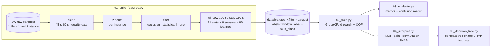
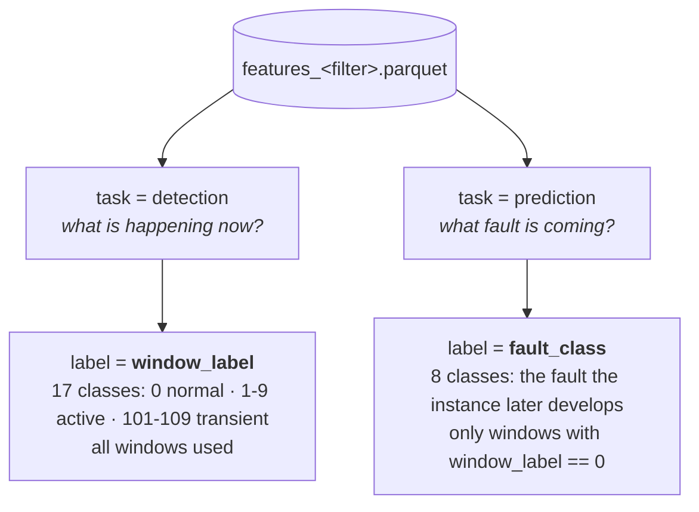
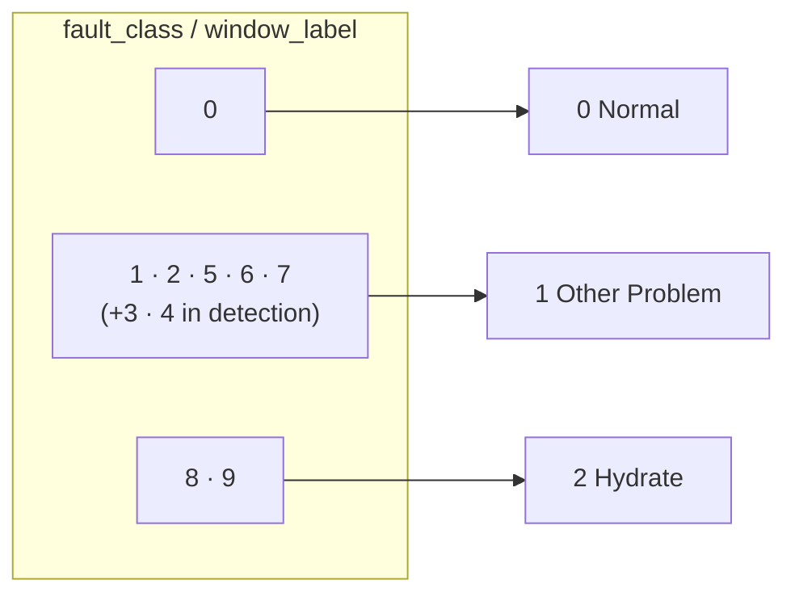
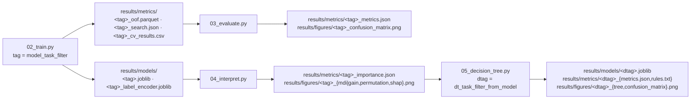

# flowml — streamlined 3W pipeline

Self-contained, script-based rewrite of the flow-assurance ML pipeline for the
[Petrobras 3W dataset](https://github.com/petrobras/3W). Two tasks, two tree
models (Random Forest, XGBoost), four stages, one features parquet.

## Pipeline



`main.py` orchestrates all five stages in order (stage 1 is skipped when its
parquet already exists).

## The two tasks

Every window row carries **both** labels, so one parquet serves both tasks:



> Prediction has 8 classes (not 10) because faults 3 (severe slugging) and
> 4 (flow instability) have no recorded normal-operation period in 3W.

## Quickstart

Requires [uv](https://docs.astral.sh/uv/) and a local copy of the 3W dataset.

```bash
cd streamline
uv sync

# point at the 3W dataset (or edit src/flowml/config.py)
export FLOWML_RAW_DATA_DIR="/path/to/3w/dataset"      # PowerShell: $env:FLOWML_RAW_DATA_DIR = "..."

# everything at once (defaults: --model xgb --task prediction --filter none)
uv run main.py                      # add --max-instances 3 for a quick smoke test

# or stage by stage
uv run scripts/01_build_features.py --filter none
uv run scripts/02_train.py
uv run scripts/03_evaluate.py
uv run scripts/04_interpret.py
uv run scripts/05_decision_tree.py  # compact tree on the top SHAP features
```

Every stage takes the same switches, and each combination writes its artifacts
under a unique tag:

| Switch | Choices | Default | Stages |
|--------|---------|---------|--------|
| `--model` | `rf`, `xgb` | `xgb` | 2–5 |
| `--task` | `prediction`, `detection` | `prediction` | 2–5 |
| `--filter` | `gaussian`, `statistical`, `none` | `none` | 1–5 |
| `--grouping` | `none`, `hydrate` | `none` | 3, 5 |

## Class groupings

`--grouping hydrate` collapses the classes onto the operational triage
question — is the well heading for normal operation, a hydrate event, or some
other flow-assurance problem? Faults 8 and 9 become **Hydrate**, every other
fault becomes **Other Problem**, and transients follow their active
counterpart:



Grouping affects **scoring only** — features and the ensemble are always built
on the full class set. Stage 5 then compares two ways of reaching the grouped
labels, both scored against the same truth:

| Strategy | Trains on | Answers |
|----------|-----------|---------|
| `collapse` | full class set, predictions collapsed afterwards | how well does the existing tree already serve the triage question? |
| `native` | the 3 grouped labels directly | what does spending the whole depth budget on this distinction buy? |

## Artifacts



## Layout

```
streamline/
├── pyproject.toml            uv project (flowml package, src layout)
├── src/flowml/
│   ├── config.py             paths · sensors · class maps · constants
│   ├── preprocessing.py      loading · cleaning · z-score · signal filters
│   ├── features.py           windowing · 88 features · labeling
│   ├── training.py           task datasets · pipelines · CV search · OOF
│   ├── evaluation.py         metrics · confusion matrix
│   ├── interpretation.py     MDI · gain · permutation · SHAP
│   └── cli.py                shared argparse
├── main.py                   runs all stages in order
├── scripts/                  the 5 pipeline stages (thin CLIs)
├── data/                     generated features (git-ignored)
└── results/                  models · metrics · figures (git-ignored)
```

## Methodology notes

- **GroupKFold by `instance_id`** everywhere — windows of one well never split
  across train/test.
- **Imputation inside the model pipeline** (`SimpleImputer(median)`), so it is
  refit per fold — no leakage. This replaces the two divergent imputation
  strategies of the original repo.
- **Balanced classes**: RF via `class_weight="balanced"`; XGBoost via sample
  weights computed **per training fold** (the original computed them globally).
- **Outliers preserved**: pressure spikes are fault signatures; `max_zscore`
  captures them instead of removing them.
- Deep-learning branches (CNN-1D, CNN-LSTM) of the original repo were dropped
  deliberately: the end goal is interpretable tree models built on the top
  SHAP features.
